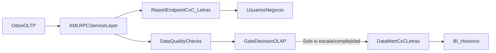

# Plan de arquitectura para reportes Odoo (CxC y Letras)

## 1) Estabilizar la capa operacional (sin ETL pesado)

- Consolidar la lógica de extracción en un único servicio base usando el patrón ya existente en `[C:\Users\jmontero\Desktop\GitHub Proyectos_AGV\Finanzas_Agv\app\collections\services.py](C:\Users\jmontero\Desktop\GitHub Proyectos_AGV\Finanzas_Agv\app\collections\services.py)`.
- Mantener XML-RPC como fuente principal vía `[C:\Users\jmontero\Desktop\GitHub Proyectos_AGV\Finanzas_Agv\app\core\odoo.py](C:\Users\jmontero\Desktop\GitHub Proyectos_AGV\Finanzas_Agv\app\core\odoo.py)` para conservar latencia baja y evitar duplicación de datos prematura.
- Formalizar un “contrato de salida” del reporte (nombres, tipos y significado de campos) para evitar cambios silenciosos por ajustes de Odoo.

## 2) Crear diccionario funcional de datos Odoo (mínimo viable)

- Inventariar por modelo los campos realmente usados por negocio:
  - `account.move.line` (hecho contable base)
  - `account.move` (cabecera factura/letra)
  - `res.partner` (cliente)
  - `account.partial.reconcile` (conciliaciones)
  - modelos custom como `agr.credit.customer`, `agr.groups`, `account.bill.form`.
- Usar scripts de investigación como base metodológica:
  - `[C:\Users\jmontero\Desktop\GitHub Proyectos_AGV\Finanzas_Agv\scripts\investigation\campos_cxc_reporte.py](C:\Users\jmontero\Desktop\GitHub Proyectos_AGV\Finanzas_Agv\scripts\investigation\campos_cxc_reporte.py)`
  - `[C:\Users\jmontero\Desktop\GitHub Proyectos_AGV\Finanzas_Agv\scripts\investigation\trazabilidad_documentos.py](C:\Users\jmontero\Desktop\GitHub Proyectos_AGV\Finanzas_Agv\scripts\investigation\trazabilidad_documentos.py)`
  - `[C:\Users\jmontero\Desktop\GitHub Proyectos_AGV\Finanzas_Agv\scripts\investigation\modulo_letras_explicacion_1.py](C:\Users\jmontero\Desktop\GitHub Proyectos_AGV\Finanzas_Agv\scripts\investigation\modulo_letras_explicacion_1.py)`
- Documentar para cada campo: fuente, regla de negocio, dependencia (many2one/relación), y validación contable esperada.

## 3) Definir trazabilidad end-to-end del reporte

- Mapear explícitamente el flujo para tus reportes: Pedido -> Factura -> Planilla -> Letra -> Cobro/Conciliación.
- Publicar una matriz de trazabilidad que permita auditar cada fila del reporte hasta su documento origen.
- Validar 10-20 casos reales de negocio (clientes nacionales/internacionales, vencidos/no vencidos, conciliados/no conciliados).

## 4) Optimizar consultas para casi tiempo real

- Priorizar `search_count`, paginación y filtros tempranos por fechas/estado/cuenta para reducir payload.
- Evitar recomputar histórico completo; usar ventanas de consulta y campos de corte (`cutoff_date`) como ya aparece en el servicio actual.
- Separar claramente:
  - cálculos transaccionales (en memoria en backend)
  - cálculos analíticos pesados (solo si superan SLA).

## 5) Criterios de decisión para migrar a OLAP (gate)

- Mantener API directa mientras se cumplan estos criterios:
  - latencia aceptable para usuario final
  - volumen controlable en ventanas de consulta
  - número limitado de reportes críticos.
- Activar mini-ETL/OLAP solo si ocurre al menos uno:
  - reportes históricos amplios y repetitivos (meses/años con alta concurrencia)
  - degradación sostenida de rendimiento en Odoo
  - necesidad de múltiples métricas agregadas complejas para BI.

## 6) Ruta OLAP incremental (cuando aplique)

- Construir primero un Data Mart de CxC/Letras (no un DWH completo).
- Cargar incremental por `write_date`/`date` y particionar por período contable.
- Mantener reconciliación diaria entre OLTP (Odoo) y mart para asegurar consistencia financiera.

## Arquitectura propuesta por fases

## Resultado esperado

- Corto plazo: reportes confiables y auditables en casi tiempo real, sin sobrecoste de infraestructura.
- Mediano plazo: decisión objetiva y técnica de cuándo sí conviene OLAP, evitando migraciones prematuras.

