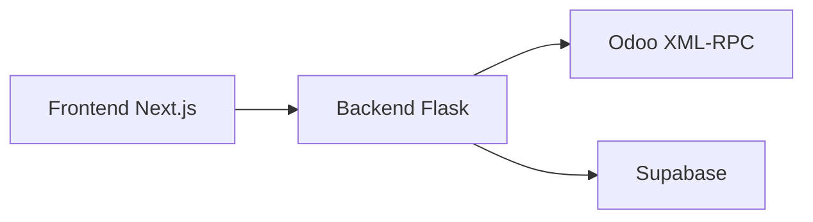

# Finanzas AGV

Aplicacion financiera para cobranzas, letras y reporteria conectada con Odoo, con backend Flask y frontend Next.js.

## Descripcion

El repositorio cubre dos frentes funcionales principales:

- `P1`: reporteria financiera de cuentas 12/42, exportaciones y validacion operativa.
- `P2`: automatizacion de letras, seguimiento y envio de correos con trazabilidad.

El estado actual del proyecto es hibrido:

- backend de negocio en Flask;
- frontend principal en Next.js;
- autenticacion por sesion Flask contra Odoo;
- integracion de datos via Odoo XML-RPC con evolucion progresiva hacia Supabase.

## Stack vigente

### Backend
- Flask
- Gunicorn
- Flask-Caching
- Flask-Compress
- Flask-Mail
- Celery inicializado en la aplicacion

### Frontend
- Next.js 16
- React 19
- Axios
- React Query

### Integraciones
- Odoo via XML-RPC
- Supabase PostgreSQL

### Seguridad
- sesion Flask;
- `withCredentials` en frontend;
- guard central de autenticacion;
- manejo de `401` con redireccion a `/login`.

## Arquitectura operativa resumida



Notas importantes:

- Flask mantiene rutas historicas y funciones de gateway.
- Next.js es la experiencia principal de UI.
- La lectura de negocio aun depende parcialmente de Odoo.
- La direccion objetivo es mover lectura operativa hacia Supabase mediante ETL incremental.

## Arranque local

### Backend con Docker

```powershell
docker compose up --build
```

Servicio principal esperado:

- `backend` en `http://localhost:5000`

### Frontend con perfil compose

```powershell
docker compose --profile frontend up
```

### Backend local sin Docker

```powershell
# Con Yarn (scripts en package.json raíz)
yarn dev

# O directamente con Python
python run.py
```

### Frontend local

```powershell
cd frontend
yarn install
yarn dev
```

## Variables de entorno relevantes

### Odoo
- `ODOO_URL`
- `ODOO_DB`
- `ODOO_USER`
- `ODOO_PASSWORD`

Para confirmar que esas credenciales autentican y que una consulta de lectura responde:

```powershell
.\scripts\etl\check_odoo.ps1
.\scripts\etl\check_odoo.ps1 -Env produccion
```

### Sesion y seguridad Flask
- `SECRET_KEY`
- `SESSION_COOKIE_NAME`
- `SESSION_COOKIE_HTTPONLY`
- `SESSION_COOKIE_SECURE`
- `SESSION_COOKIE_SAMESITE`
- `SESSION_LIFETIME_MINUTES`

### Frontend
- `FRONTEND_URL`
- `NEXT_PUBLIC_FLASK_API_URL`

### Supabase
- variables definidas segun `config.py`
- archivos por entorno como `.env.supabase.desarrollo` y `.env.supabase.produccion`

### Correo
- `MAIL_SERVER`
- `MAIL_PORT`
- `MAIL_USE_TLS`
- `MAIL_USERNAME`
- `MAIL_PASSWORD`

## Autenticacion

La autenticacion vigente es por sesion, no por JWT:

1. el frontend envia credenciales al backend;
2. el backend autentica contra Odoo;
3. Flask guarda la sesion;
4. el frontend consulta estado de usuario;
5. ante `401`, el cliente redirige a `/login`.

## Documentacion oficial

La fuente de verdad documental ya no debe ser el portal HTML legado en `docs/`.

Documentacion vigente:

- wiki del proyecto como repositorio documental principal;
- `README.md` como resumen ejecutivo del repo de aplicacion.

Documentacion historica o absorbida:

- `docs/legacy/*`
- `docs/*.html`
- `docs/presentacion_prd/*.html`

Si `docs/` aun existe en una copia local, debe tratarse como snapshot transitorio o material historico, no como referencia oficial.

## Referencias internas utiles

- `docker-compose.yml`
- `config.py`
- `app/__init__.py`
- `app/auth/security.py`
- `app/web/routes.py`
- `frontend/package.json`
- `frontend/lib/api.ts`
- `frontend/components/app-shell.tsx`

## Flujo de trabajo recomendado

1. crear una rama por cambio;
2. separar cambios funcionales de migraciones documentales cuando sea posible;
3. usar commits convencionales como `feat:`, `fix:`, `docs:` y `chore:`;
4. mantener la wiki del proyecto sincronizada cuando cambie arquitectura, seguridad u operacion.

## Estado documental de este repo

Este repositorio conserva codigo y un resumen operativo.  
La wiki del proyecto concentra:

- arquitectura actual vs target;
- seguridad y checklist OWASP;
- modelos Odoo y trazabilidad;
- manuales vigentes;
- bitacora, guia visual y estrategia de datos;
- inventario de absorcion para decomisionar `docs/`.
