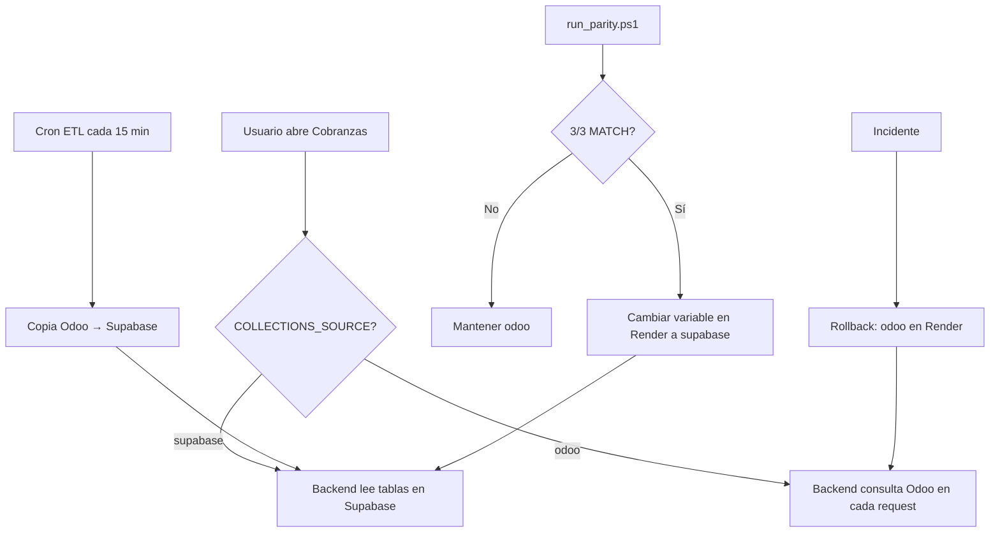

# Despliegue DevSecOps — Finanzas AGV

Guía operativa paso a paso para desplegar en Render con CI/CD en GitHub Actions.  
Lenguaje directo, sin jerga innecesaria.

**Documentos relacionados:** [PRD Arquitectura de Datos](PRD_ARQUITECTURA_DATOS.html) · [ETL y paridad](../scripts/etl/README.md)

---

## 1. Resumen en 30 segundos

**¿Qué hace el pipeline?**

1. Cada cambio en el repo pasa por **GitHub Actions** (busca secretos filtrados, revisa seguridad, construye Docker y el frontend).
2. Si el merge llega a la rama de producción, **Render despliega solo** (backend, frontend y cron ETL).
3. El **cron ETL** copia datos de Odoo a Supabase cada 15 minutos — en segundo plano, sin que el usuario lo note.
4. Antes de que Cobranzas lea de Supabase, debes confirmar **paridad 3/3 MATCH** (Odoo y Supabase dan los mismos totales).
5. El cambio a Supabase es **una variable de entorno** en Render (`COLLECTIONS_SOURCE`). Reversible en segundos.

**¿Cuándo usar cada modo?**

| Modo | `COLLECTIONS_SOURCE` | Cuándo |
|------|------------------------|--------|
| **A — Seguro (primer deploy)** | `odoo` | Producción recién desplegada. Cobranzas pregunta a Odoo en cada clic. El ETL llena Supabase sin afectar usuarios. |
| **B — Validación local** | `supabase` | En tu PC, después de correr ETL y paridad, para probar la pantalla antes del go-live. |
| **C — Producción final** | `supabase` | **Solo** después de paridad **3/3 MATCH**. Cobranzas lee de Supabase; más rápido y sin cargar Odoo en cada filtro. |

**Regla de oro:** no pases a modo C hasta ver `3/3 escenarios con totales idénticos` en `run_parity.ps1`.

---

## 2. Paso 8 explicado SIMPLE (cambiar a Supabase en Render)

> **Paso 8 del plan:** Paridad 3/3 → cambiar `COLLECTIONS_SOURCE=supabase` en Render.

### ¿Qué significa en palabras simples?

Hoy, cada vez que alguien abre Cobranzas y aplica un filtro, el backend **llama a Odoo en vivo**.  
Cuando cambias la variable a `supabase`, Cobranzas **deja de preguntarle a Odoo en cada clic** y lee de las tablas que el cron ETL ya copió a Supabase.

- Los usuarios ven la misma pantalla.
- Los datos pueden tener hasta ~15 min de retraso respecto a Odoo (intervalo del cron).
- Si algo sale mal, vuelves a `odoo` en 30 segundos (ver rollback al final).

### ¿Cuándo hacerlo?

**SOLO después de 3/3 MATCH.**  
Si ves `1/3`, `2/3` o cualquier escenario `DIFF`, **no cambies la variable**. Sigue en `odoo` y corrige paridad primero (ver [scripts/etl/README.md](../scripts/etl/README.md)).

**Estado actual (julio 2026):** paridad **1/3** — solo `con_cutoff` hace MATCH; `sin_fecha_limit_200` y `ultimo_mes` aún difieren. **NO-GO** para el switch.

---

### Paso 1: Abre PowerShell en la raíz del repo

```powershell
cd "c:\Users\jmontero\Desktop\GitHub Proyectos_AGV\Finanzas_Agv"
```

### Paso 2: Corre el test de paridad

```powershell
.\scripts\etl\run_parity.ps1
```

Usa `.env.produccion` automáticamente (`APP_ENV=production`). Para pruebas con otro entorno:

```powershell
.\scripts\etl\run_parity.ps1 -Env desarrollo
```

### Paso 3: Lee la salida — ¿estás listo?

Busca al final algo como esto:

```
================================================================================================
RESUMEN FINAL
================================================================================================
  MATCH   sin_fecha_limit_200
  MATCH   ultimo_mes (2025-06-14 .. 2025-07-14)
  MATCH   con_cutoff (cutoff=2025-06-29)

3/3 escenarios con totales idénticos
```

**Señales de GO (adelante):**

- Las tres líneas dicen `MATCH`.
- El resumen dice `3/3 escenarios con totales idénticos`.
- El script termina con **exit code 0** (en PowerShell: `$LASTEXITCODE` es `0`).

**Señales de NO-GO (detente):**

- Alguna línea dice `DIFF`.
- El resumen dice `1/3`, `2/3`, etc.
- Exit code **1**.

Si hay DIFF, no entres a Render a cambiar nada. Revisa ETL (`run_etl.ps1`) o reset de watermark según [README ETL](../scripts/etl/README.md).

### Paso 4: Entra a render.com

1. Inicia sesión en [dashboard.render.com](https://dashboard.render.com).
2. Abre el proyecto **Finanzas AGV** (o el blueprint que creaste desde este repo).

### Paso 5: Abre las variables del backend

1. Clic en **Environment** (menú lateral) o en el grupo de servicios del blueprint.
2. Clic en el servicio **`finanzas-agv-backend`**.
3. Clic en **Environment** (pestaña o sección de variables).

### Paso 6: Cambia COLLECTIONS_SOURCE

1. Busca la variable **`COLLECTIONS_SOURCE`**.
2. El valor actual debería ser **`odoo`** (despliegue seguro).
3. Cámbialo a **`supabase`** (todo minúsculas).
4. Clic en **Save Changes**.

Render reinicia el servicio automáticamente. No hace falta redeploy de código ni tocar Git.

### Paso 7: Verifica que funcionó

**7a — Health del backend**

Abre en el navegador (o con curl):

```
https://<tu-backend-render>/api/health
```

Debe responder **200** y mostrar servicios conectados.

**7b — Pantalla Cobranzas**

1. Abre el frontend Render (URL de `finanzas-agv-frontend`).
2. Inicia sesión con un correo de la lista blanca (`ALLOWED_USERS`).
3. Entra a **`/collections`**.
4. Aplica un filtro (fechas, cliente). La tabla debe cargar sin error.
5. Los totales deben ser coherentes (comparables con lo que viste en paridad).

**7c — Diagnósticos**

Entra a **`/diagnostics`** en el frontend.

- Debe mostrar conteos de tablas Supabase (no vacío si el ETL corrió).
- Sin errores de conexión a `SUPABASE_DB_URI`.

**7d — RBAC y Centro de aplicaciones**

1. Aplicar DDL (una vez) en Supabase SQL Editor o MCP:
   - `scripts/etl/supabase_schema_app_users.sql`
   - `scripts/etl/supabase_schema_app_platforms.sql`
   - `scripts/etl/supabase_schema_user_activity.sql` (requerido por `/observability`)
2. Confirmar `ADMIN_EMAILS=jose.montero@agrovetmarket.com` y `SUPABASE_KEY` real en `.env.produccion` (no placeholders `TODO_*` del overlay `.env.supabase.produccion`).
3. Login admin → sidebar **Aplicaciones** (`/apps`) y **Observabilidad** (`/observability`).
4. Login `app_assistant` → solo `/apps` (sin telemetría de personas); puede crear/editar rol `user`.
5. Login `user` → sin `/apps` ni `/observability`.
6. `ALLOWED_USERS` queda como red de seguridad hasta que todos los usuarios activos estén en `app_users`.
7. Si `/apps` o `/observability` responden 500 con *Invalid API key*, reiniciar Flask tras corregir el env (`.\venv\Scripts\python.exe .\run.py production`).
8. Alta de un correo **nuevo** `@agrovetmarket.com` en `/apps` → aparece en la tabla. Email duplicado → 409. Dominio ajeno → 400.
9. Editar nombre / Desactivar un usuario **no protegido** → cambia en UI y en `app_users`. El usuario desactivado recibe 401 en el siguiente request API.
10. En `/observability` (solo admin): logins en hora Lima, KPI de logins fallidos, tabla de actividad reciente y auditoría de altas/roles.

**7e — (Opcional) Smoke en GitHub Actions**

Si ya tienes el workflow `post-deploy-smoke.yml`, ejecútalo manualmente con la URL del backend.

### Rollback en 30 segundos

Si Cobranzas falla, va lenta de forma anormal o los números no cuadran:

1. Render → **`finanzas-agv-backend`** → **Environment**.
2. **`COLLECTIONS_SOURCE`** → vuelve a **`odoo`**.
3. **Save Changes**.

En menos de un minuto los usuarios vuelven a leer Odoo en vivo. El cron ETL sigue corriendo; no pierdes datos en Supabase.

---

### Diagrama del flujo (paso 8)



---

## 3. Migración cobranzas_2 → main (Fase 5)

Hoy el código nuevo está en **`cobranzas_2`** (12 commits por delante de `main`). `main` es ancestro directo: el merge es **fast-forward** (sin conflictos, sin force-push).

### ¿Por qué hacerlo?

- GitHub, Render y la protección de ramas asumen **`main`** como producción.
- Evita deuda técnica (CI disparando en `cobranzas_2` para siempre).

### Paso 1: Guarda todo en cobranzas_2

Antes de tocar `main`, commitea y pushea el trabajo pendiente:

```bash
git checkout cobranzas_2
git add <archivos relevantes>
git commit -m "Tu mensaje"
git push origin cobranzas_2
```

### Paso 2: Fast-forward de main

```bash
git checkout main
git pull origin main
git merge cobranzas_2
git push origin main
```

Si `main` no tenía commits propios, Git no crea merge commit: solo avanza el puntero. Eso es el fast-forward.

### Paso 3: Reapunta integraciones

| Dónde | Qué cambiar |
|-------|-------------|
| **Render** → cada servicio (backend, frontend, cron ETL) | Settings → **Branch** = `main` |
| **GitHub Actions** | Workflows deben disparar en `main` (quitar `cobranzas_2` cuando corresponda) |
| **GitHub** → Settings → Branches | Branch protection y required checks en `main` |

### Paso 4 (opcional): Limpiar rama vieja

Solo después de confirmar que Render despliega bien desde `main`:

```bash
git push origin --delete cobranzas_2
```

O conserva `cobranzas_2` unos días como respaldo.

### Qué NO hacer

- **No** `git push --force` a `main` (innecesario aquí).
- **No** borrar `cobranzas_2` antes de verificar el deploy desde `main`.
- **No** desplegar en Render sin haber pusheado el código local.

---

## 4. Checklist go-live Render

Completa **antes** del switch a `COLLECTIONS_SOURCE=supabase`. El primer deploy puede usar `odoo` mientras el ETL sincroniza.

### 4.1 Conectar el repo

1. Render → **New** → **Blueprint**.
2. Repo `Finanzas_Agv` → archivo `render.yaml`.
3. Activar **Auto-Deploy** en los 3 servicios: `finanzas-agv-backend`, `finanzas-agv-frontend`, `finanzas-agv-etl`.

### 4.2 Variables de entorno (cargar en dashboard — nunca en el repo)

Variables con `sync: false` en `render.yaml` debes pegarlas manualmente en Render.

**Backend (`finanzas-agv-backend`)**

| Variable | Notas |
|----------|--------|
| `APP_ENV` | `production` (viene del blueprint) |
| `COLLECTIONS_SOURCE` | Empezar con **`odoo`**; cambiar a `supabase` tras paridad 3/3 |
| `SECRET_KEY` | Clave Flask única y larga |
| `JWT_SECRET_KEY` | Clave JWT única (no usar default) |
| `ALLOWED_USERS` | Fallback temporal de whitelist hasta completar seed en `app_users` (Supabase). Separados por coma |
| `ADMIN_EMAILS` | **Único admin bootstrap**: `jose.montero@agrovetmarket.com` (fuerza rol `admin` en login; no asignable vía UI) |
| `ODOO_URL`, `ODOO_DB`, `ODOO_USER`, `ODOO_PASSWORD` | Credenciales Odoo lectura producción. Validar localmente con `.\scripts\etl\check_odoo.ps1 -Env produccion` antes de copiarlas a Render |
| `SUPABASE_URL`, `SUPABASE_KEY` | Service role para ETL y backend |
| `SUPABASE_DB_URI` | Pooler Postgres **`:6543`** (no conexión directa `:5432`) |
| `GOOGLE_CLIENT_ID`, `GOOGLE_CLIENT_SECRET` | OAuth Google |
| `FRONTEND_URL` | URL pública del frontend Render (redirects post-login) |
| `LETTERS_MODULE_ENABLED` | `false` en producción piloto |

**Frontend (`finanzas-agv-frontend`)**

| Variable | Notas |
|----------|--------|
| `NEXT_PUBLIC_FLASK_API_URL` | URL **completa** del backend Render con `https://` (ej. `https://finanzas-agv-backend.onrender.com`; sin barra final). Ver §4.3 si el login redirige mal. |
| `NEXT_PUBLIC_SUPABASE_URL` | URL del proyecto Supabase |
| `NEXT_PUBLIC_SUPABASE_ANON_KEY` | Anon key pública |
| `NEXT_PUBLIC_ENABLE_LETTERS` | `false` |

**Comandos Render (frontend, Root Directory = `frontend`):**

| Campo | Valor |
|-------|--------|
| Build Command | `yarn install && yarn build` |
| Start Command | `yarn start` |

**Backend local (Yarn en raíz del repo):** `yarn dev`, `yarn etl`, `yarn test`, `yarn parity`

**Cron ETL (`finanzas-agv-etl`)**

| Variable | Notas |
|----------|--------|
| `APP_ENV` | `production` |
| `ODOO_*` | Mismas credenciales Odoo que el backend |
| `SUPABASE_URL`, `SUPABASE_KEY` | Mismas que el backend |

### 4.3 OAuth Google

El login con Google **no** ocurre en el frontend: el botón redirige al backend (`/api/v1/auth/google`) y Google devuelve el `code` al **callback del backend**. Por eso `NEXT_PUBLIC_FLASK_API_URL` debe ser una URL absoluta con protocolo; si falta `https://`, el navegador interpreta la ruta como relativa y termina en URLs rotas como `finanzas-agv-frontend.onrender.com/finanzas-agv-backend.onrender.com/api/v1/auth/google`.

#### Render — frontend (`finanzas-agv-frontend`)

| Variable | Valor correcto (ejemplo producción) |
|----------|-------------------------------------|
| `NEXT_PUBLIC_FLASK_API_URL` | `https://finanzas-agv-backend.onrender.com` |

**Reglas:**

- Debe incluir `https://` (o `http://` solo en local).
- Sin barra final (`/`).
- **Incorrecto:** `finanzas-agv-backend.onrender.com` (sin protocolo).

#### Render — backend (`finanzas-agv-backend`)

| Variable | Valor correcto (ejemplo producción) |
|----------|-------------------------------------|
| `FRONTEND_URL` | `https://finanzas-agv-frontend.onrender.com` |

Tras cambiar `NEXT_PUBLIC_FLASK_API_URL` en Render, redeploy del frontend (Save Changes reinicia el servicio).

#### Google Cloud Console → OAuth 2.0 Client

[Google Cloud Console](https://console.cloud.google.com/) → APIs & Services → Credentials → tu cliente OAuth.

**Authorized JavaScript origins** (orígenes permitidos para el flujo en el navegador):

```
http://localhost:3000
http://localhost:5000
https://finanzas-agv-frontend.onrender.com
https://finanzas-agv-backend.onrender.com
```

Sin barra final en cada origen.

**Authorized redirect URIs** (solo callbacks del backend Flask):

```
http://localhost:5000/api/v1/auth/google/callback
https://finanzas-agv-backend.onrender.com/api/v1/auth/google/callback
```

La ruta exacta del callback es `/api/v1/auth/google/callback` (prefijo `auth_bp` en Flask).

**Eliminar de la configuración actual (incorrecta):**

| URI a borrar | Motivo |
|--------------|--------|
| `http://localhost:3000/authorize` | El frontend Next.js no recibe el callback de Google; esa ruta no existe en la app. |
| Cualquier URI del backend **sin** `/api/v1/auth/google/callback` | Google debe devolver el `code` al endpoint de callback del backend, no a la raíz del dominio. |

**No agregar** redirect URIs del frontend (`finanzas-agv-frontend.onrender.com/...`); el usuario vuelve al frontend solo después de que el backend procesa el callback y redirige con `FRONTEND_URL`.

### 4.4 Cron ETL

1. Render → servicio **`finanzas-agv-etl`**.
2. Verifica schedule: `*/15 * * * *` (cada 15 min).
3. Tras el primer deploy: **Manual Deploy** → **Run now** (o espera la primera ventana).
4. Revisa logs: sin errores de auth Odoo ni Supabase.

### 4.5 Secuencia recomendada día del go-live

1. Merge a `main` → Render despliega con `COLLECTIONS_SOURCE=odoo`.
2. Cron ETL corre y llena Supabase.
3. `run_parity.ps1` → **3/3 MATCH**.
4. Cambiar `COLLECTIONS_SOURCE=supabase` (sección 2).
5. Probar `/collections` y `/diagnostics`.
6. Login con usuario de lista blanca y uno fuera de lista (debe rechazar).

---

## 5. GitHub Secrets necesarios para CI

Configurar en GitHub → **Settings** → **Secrets and variables** → **Actions**.  
Para paridad en entorno protegido, usa un **Environment** llamado `production` con aprobación manual opcional.

### Secrets para `parity.yml` (workflow manual)

| Secret | Uso |
|--------|-----|
| `ODOO_URL` | URL XML-RPC Odoo producción |
| `ODOO_DB` | Nombre de base Odoo |
| `ODOO_USER` | Usuario Odoo |
| `ODOO_PASSWORD` | Contraseña Odoo |
| `SUPABASE_DB_URI` | Connection string pooler Postgres |
| `SUPABASE_URL` | URL REST Supabase |
| `SUPABASE_KEY` | Service role key |

El script `scripts/ci/run_parity.sh` (cuando exista en el repo) inyecta estas variables y ejecuta `test_collections_parity.py --env produccion`.

### Secrets / inputs para `post-deploy-smoke.yml`

| Nombre | Tipo | Uso |
|--------|------|-----|
| `BACKEND_URL` | input del workflow o variable | URL base del backend Render para `GET /api/health` |

### Secrets opcionales para herramientas de CI

| Secret | Uso |
|--------|-----|
| `GITLEAKS_LICENSE` | Solo si usas gitleaks con licencia corporativa (el action público suele bastar) |
| `RENDER_API_KEY` | Solo si automatizas deploys o smoke vía API Render (no obligatorio con blueprint + auto-deploy) |

### `ci.yml` — en general no necesita secrets de Odoo/Supabase

Los jobs de seguridad (gitleaks, bandit, pip-audit), build Docker, lint/build frontend y Trivy corren **sin** credenciales de producción. No pongas `ODOO_PASSWORD` ni `SUPABASE_KEY` en secrets globales si solo los usa el workflow de paridad.

### Branch protection (recomendado tras migrar a main)

En `main`:

- Require PR before merge.
- Require status checks: jobs de `ci.yml`.
- Opcional: require aprobación del environment `production` antes de ejecutar `parity.yml`.

---

## Referencia rápida de comandos

```powershell
# Paridad (bloqueante para supabase)
.\scripts\etl\run_parity.ps1

# ETL manual si hace falta refrescar Supabase
.\scripts\etl\run_etl.ps1

# Reset watermark + re-ETL si paridad falla en conteos
.\scripts\etl\reset_watermark.ps1
.\scripts\etl\run_etl.ps1
.\scripts\etl\run_parity.ps1
```

```bash
# Migración de rama
git checkout main && git pull origin main && git merge cobranzas_2 && git push origin main
```

**Rollback producción:** Render → `finanzas-agv-backend` → `COLLECTIONS_SOURCE=odoo` → Save.
