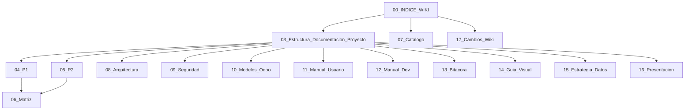

# Wiki de Documentacion - Finanzas AGV

**Fecha**: 06 de Marzo de 2026  
**Version**: 2.0  
**Objetivo**: Centralizar la documentacion funcional, tecnica, de seguridad, arquitectura y gobierno documental del proyecto en formato Markdown.

---

## 1. Fuente de verdad documental

### Documentacion vigente
La carpeta `docs/Wiki_Documentacion` es la fuente de verdad operativa para:
- stack actual y stack objetivo;
- arquitectura y flujo de datos;
- seguridad y controles tipo OWASP;
- modelos Odoo y trazabilidad;
- manuales vigentes;
- bitacora, guia visual y presentacion canonica.

### Documentacion historica
La carpeta `docs/legacy` se mantiene como fuente historica y de contraste.  
No debe considerarse automaticamente vigente sin haber sido absorbida o reconciliada en esta wiki.

---

## 2. Estados documentales

- `vigente`: refleja el estado actual verificado en repo y documentacion consolidada.
- `target`: describe el objetivo tecnico o funcional al que se apunta.
- `parcial`: documenta capacidades implementadas de forma incompleta o hibrida.
- `historico`: referencia previa que se conserva por trazabilidad.

---

## 3. Estructura de documentos

1. `00_INDICE_WIKI.md` - Navegacion principal de la wiki y gobierno documental.
2. `01_Especificacion_Requisitos_y_Diseño.md` - Requisitos y modelo de datos orientados al target.
3. `02_Scripts_SQL.sql` - DDL base para el modelo analitico/documental.
4. `03_Estructura_Documentacion_Proyecto.md` - Mapa general del proyecto, stack vigente, target y trazabilidad.
5. `04_Especificacion_P1_Reporteria_12_42.md` - Especificacion detallada del Proyecto P1.
6. `05_Especificacion_P2_Letras_Correos.md` - Especificacion detallada del Proyecto P2.
7. `06_Matriz_RF_RNF_RN_vs_Tabla_SQL.md` - Matriz requisito -> dato -> SQL.
8. `07_Catalogo_Documentos_Origen.md` - Catalogo y trazabilidad de fuentes `legacy` y HTML.
9. `08_Arquitectura_Actual_vs_Target.md` - Comparativo AS-IS vs TO-BE con evidencia del repo.
10. `09_Seguridad_OWASP_y_Checklist.md` - Revision de seguridad, checklist y gaps.
11. `10_Modelos_Odoo_Letras_y_Trazabilidad.md` - Modelado Odoo real de letras y puente factura-planilla-letra.
12. `11_Manual_Usuario_Operacion_Actual.md` - Manual vigente para operacion funcional.
13. `12_Manual_Desarrollador_Arquitectura_Actual.md` - Manual vigente para desarrollo y despliegue.
14. `13_Bitacora_Proyecto.md` - Bitacora consolidada de decisiones y cambios.
15. `14_Guia_Visual_y_Paleta.md` - Guia visual oficial y paleta canonica.
16. `15_Estrategia_Integracion_Datos_XMLRPC_a_ETL.md` - Estrategia para reducir dependencia de XML-RPC.
17. `16_Presentacion_Canonica_Gerencia.md` - Narrativa ejecutiva canonica basada en `ejemplo6.html`.
18. `17_Cambios_Introducidos_en_Wiki_Documentacion.md` - Resumen de cambios para migrar esta wiki a otro repositorio o carpeta.

---

## 4. Ruta recomendada de lectura

### Para gerencia y stakeholders
1. `03_Estructura_Documentacion_Proyecto.md`
2. `08_Arquitectura_Actual_vs_Target.md`
3. `16_Presentacion_Canonica_Gerencia.md`

### Para analisis funcional
1. `04_Especificacion_P1_Reporteria_12_42.md`
2. `05_Especificacion_P2_Letras_Correos.md`
3. `10_Modelos_Odoo_Letras_y_Trazabilidad.md`

### Para equipo tecnico
1. `08_Arquitectura_Actual_vs_Target.md`
2. `09_Seguridad_OWASP_y_Checklist.md`
3. `12_Manual_Desarrollador_Arquitectura_Actual.md`
4. `15_Estrategia_Integracion_Datos_XMLRPC_a_ETL.md`

---

## 5. Mapa de la wiki

---

## 6. Convenciones de documentacion

- IDs de requisitos: `RF-xxx`, `RNF-xxx`, `RN-xxx`.
- Proyectos principales:
  - `P1`: Reporteria Financiera Cuenta 12/42.
  - `P2`: Automatizacion de Letras y Correos.
- Todo diagrama se publica en Mermaid dentro de archivos `.md`.
- Cada documento debe incluir:
  - fecha;
  - version;
  - estado documental;
  - fuentes utilizadas;
  - relacion con otros documentos de la wiki.

---

## 7. Fuentes reconciliadas

- `docs/legacy/markdown/ARQUITECTURA_ACTUAL_DOCKER.md`
- `docs/legacy/markdown/analisis-integracion-datos.md`
- `docs/legacy/guion_reunion_odoo_letras_facturas.md`
- `docs/legacy/markdown/letras.md`
- `docs/legacy/markdown/manual_usuario.md`
- `docs/legacy/markdown/manual_desarrollador.md`
- `docs/legacy/CHECKLIST_SEGURIDAD.md`
- `docs/bitacora.html`
- `docs/guia_diseno.html`
- `docs/presentacion_prd/ejemplo6.html`

