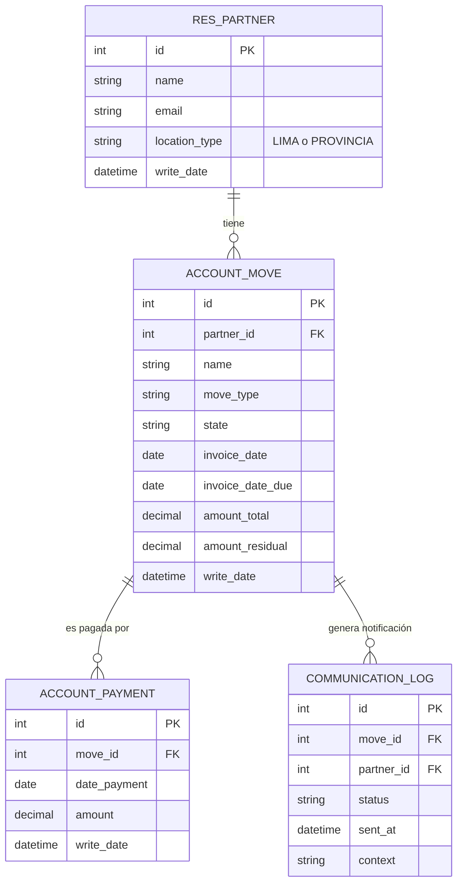

# Especificación de Requisitos y Diseño de Base de Datos
## Proyecto: Ecosistema Financiero High-Performance v1.0 (Finanzas AGV)

**Fecha**: 06 de Marzo de 2026  
**Versión**: 1.0  
**Fuentes**: 
- `docs/legacy/DOCUMENTACION_COMPLETA_GERENCIA.md`
- `docs/legacy/markdown/analisis-arquitectonico-completo.md`
- `docs/legacy/markdown/analisis-integracion-datos.md`
- `docs/presentacion_prd/ejemplo3.html`

---

## 1. Resumen Ejecutivo
El Ecosistema Financiero High-Performance v1.0 es un satélite de inteligencia de datos diseñado para escalar la gestión de tesorería y cobranzas de Agrovet Market sin las limitaciones del ERP Odoo v17 actual. Su objetivo es desacoplar las operaciones pesadas de lectura y reportes (BI, ETL, generación masiva de estados de cuenta) de la base de datos principal de Odoo, logrando una arquitectura AP (Alta Disponibilidad y Tolerancia a Particiones), previniendo bloqueos en el ERP, y permitiendo cálculos analíticos intensivos, cortes históricos precisos y automatización de notificaciones.

---

## 2. Requisitos Funcionales

### RF-001: Reportes Masivos de Cuenta 12 y 42
- **Descripción**: El sistema debe permitir generar y exportar a Excel reportes de antigüedad (aging) de manera asíncrona, soportando grandes volúmenes de datos (+50,000 registros) sin bloquear al usuario o al ERP original.
- **Actor**: Analistas de Cobranzas / Cuentas por Pagar.
- **Prioridad**: Must Have
- **Criterios de Aceptación**:
  - [x] Consulta y procesamiento en background mediante Celery + Redis.
  - [x] Generación de archivos Excel manteniendo tipos de dato (Date/Numeric).

### RF-002: Corte Financiero Retroactivo
- **Descripción**: El sistema debe poder calcular y visualizar el saldo de la cartera a una fecha pasada determinada, ignorando movimientos posteriores.
- **Actor**: Gerente Financiero.
- **Prioridad**: Must Have
- **Criterios de Aceptación**:
  - [x] Selector de fecha en interfaz con bloqueo para fechas futuras.
  - [x] Algoritmo de reversión de pagos basado en el campo `date_payment` de las facturas.
  - [x] Conciliación exacta con el balance de comprobación de Odoo.

### RF-003: Notificación Masiva de Letras Vencidas
- **Descripción**: Permite el envío masivo automatizado de correos con estados de cuenta a clientes que tienen letras vencidas, para incentivar el recupero.
- **Actor**: Analistas de Cobranzas.
- **Prioridad**: Must Have
- **Criterios de Aceptación**:
  - [x] Filtrar letras por estado "Por Recuperar" y clasificación de ubicación.
  - [x] Adjuntar al correo automáticamente los PDFs originales provenientes de Odoo.
  - [x] Validar que el formato del correo electrónico sea correcto.

### RF-004: Prevención de Spam de Notificaciones
- **Descripción**: El sistema debe evitar enviar notificaciones repetidas sobre la misma letra dentro de una ventana de 24 horas.
- **Actor**: Sistema automatizado.
- **Prioridad**: Should Have
- **Criterios de Aceptación**:
  - [x] Registro y validación del estado del envío ("Notificado") impidiendo envíos dobles en la misma sesión operativa de 24h.

### RF-005: Identificación y Clasificación de Letras
- **Descripción**: El sistema debe rastrear e identificar el origen de cada letra en el sistema e identificar en qué estado se encuentra automáticamente.
- **Actor**: Sistema automatizado.
- **Prioridad**: Must Have
- **Criterios de Aceptación**:
  - [x] Mapeo desde `account.bill.form` para encontrar factura de origen.
  - [x] Separación en estados: "Por Aceptar", "Banco (Descuento/Cobranza)".

### RF-006: Pipeline ETL de Sincronización
- **Descripción**: Un proceso en background debe replicar los datos esenciales desde Odoo hacia la base de datos de consulta local (Supabase/PostgreSQL) cada 15 a 30 minutos.
- **Actor**: Worker ETL (Celery).
- **Prioridad**: Must Have
- **Criterios de Aceptación**:
  - [x] Ejecución periódica con Celery.
  - [x] Consulta solo de registros actualizados (`write_date > ultimo_sync`).

---

## 3. Requisitos No Funcionales

### Rendimiento y Disponibilidad
- **RNF-001**: **Velocidad de Respuesta**: El tiempo de latencia de carga en reportes debe ser `< 200ms`, apoyado sobre PostgreSQL directo y esquivando XML-RPC.
- **RNF-002**: **Alta Disponibilidad (Arquitectura AP)**: El sistema debe ser capaz de operar en modo 'Read-Only' si el ERP (Odoo) pierde la conexión, basándose en la última data replicada.

### Seguridad y Auditoría
- **RNF-003**: **Autenticación y Roles**: Integración mediante Supabase Auth u otro sistema similar que controle niveles de acceso (Administrador, Analista, Gerente).
- **RNF-004**: **Logs de Acciones**: Registro auditable de todas las acciones importantes (ej: exportación masiva de datos y envíos de correo).

### Escalabilidad
- **RNF-005**: La arquitectura debe escalar de manera horizontal apoyándose en el pool de trabajadores Celery y en la separación entre Base de Datos transaccional y analítica (Read Replica / ODS en Supabase).

---

## 4. Modelo de Base de Datos

### 4.1 Diagrama Entidad-Relación

### 4.2 Tablas Maestras (Replicadas)

#### res_partner
**Propósito**: Almacenar clientes y proveedores obtenidos del ERP.

| Campo | Tipo | Restricciones | Descripción |
|-------|------|---------------|-------------|
| id | PK, Integer | NOT NULL, UNIQUE | Identificador original de Odoo |
| name | Varchar(255) | NOT NULL | Razón social o nombre |
| email | Varchar(150) | | Correo electrónico principal |
| location_type | Enum | 'LIMA', 'PROVINCIA' | Utilizado para definir la regla de días de notificación |
| write_date | Datetime | NOT NULL | Fecha de última modificación para ETL |

**Índices:**
- PRIMARY KEY: `id`
- INDEX: `idx_partner_write` en `write_date`

### 4.3 Tablas Transaccionales (Replicadas)

#### account_move
**Propósito**: Registra todas las facturas y letras sincronizadas desde Odoo.

| Campo | Tipo | Restricciones | Descripción |
|-------|------|---------------|-------------|
| id | PK, Integer | NOT NULL, UNIQUE | ID original de la factura/letra en Odoo |
| partner_id | FK, Integer | NOT NULL | Referencia al cliente o proveedor |
| name | Varchar(100) | | Número del comprobante o letra |
| move_type | Varchar(50) | | Tipo de documento (ej: out_invoice, out_receipt) |
| state | Varchar(50) | | Estado actual del documento |
| invoice_date | Date | | Fecha de emisión |
| invoice_date_due | Date | | Fecha de vencimiento |
| amount_total | Numeric(15,2)| DEFAULT 0.0 | Monto total |
| amount_residual| Numeric(15,2)| DEFAULT 0.0 | Saldo pendiente (en vivo) |
| write_date | Datetime | NOT NULL | Usado para sincronización ETL incremental |

**Índices:**
- PRIMARY KEY: `id`
- INDEX: `idx_move_due_date` en `invoice_date_due`
- INDEX: `idx_move_partner` en `partner_id`

#### account_payment
**Propósito**: Registrar el histórico de pagos aplicados a las facturas, vital para el cálculo del corte financiero retroactivo.

| Campo | Tipo | Restricciones | Descripción |
|-------|------|---------------|-------------|
| id | PK, Integer | NOT NULL, UNIQUE | ID de pago original |
| move_id | FK, Integer | NOT NULL | Documento afectado |
| date_payment | Date | NOT NULL | Fecha real de pago para algoritmo de reversión |
| amount | Numeric(15,2)| NOT NULL | Monto aplicado |
| write_date | Datetime | NOT NULL | Control de sincronización ETL |

**Índices:**
- PRIMARY KEY: `id`
- INDEX: `idx_payment_move` en `move_id`
- INDEX: `idx_payment_date` en `date_payment`

### 4.4 Tablas de Auditoría

#### communication_log
**Propósito**: Trazabilidad de correos enviados y gestión preventiva de envíos duplicados (Spam Prevention).

| Campo | Tipo | Restricciones | Descripción |
|-------|------|---------------|-------------|
| id | PK, BigInt | AUTO_INCREMENT | Identificador local de log |
| move_id | FK, Integer | NOT NULL | Relación al documento (Letra/Factura) notificado |
| partner_id | FK, Integer | NOT NULL | Relación al contacto receptor |
| status | Varchar(50) | DEFAULT 'SENT' | Estado del envío (SENT, FAILED, DELIVERED) |
| sent_at | Datetime | DEFAULT NOW() | Momento exacto de la notificación |
| context | Text | | Detalles de la operación o motivos de fallo |

**Índices:**
- PRIMARY KEY: `id`
- INDEX: `idx_log_sent_at` en `sent_at`
- INDEX: `idx_log_move_partner` en `move_id, partner_id` (Para validación regla 24h)

---

## 5. Reglas de Negocio

### RN-001: Lógica de Notificación por Ubicación
- **Clientes en Lima**: La notificación de recuperación o recordatorio se dispara a los **Día +7** desde la fecha de vencimiento (`invoice_date_due`).
- **Clientes en Provincia**: Por temas logísticos, el margen se extiende y la alerta ocurre a los **Día +15**.

### RN-002: Prevención Anti-Spam (RF-004)
- El sistema bloqueará cualquier intento de reenvío de notificación para un mismo `move_id` y `partner_id` si existe un registro en `communication_log` con estado exitoso dentro de las últimas 24 horas.

### RN-003: Corte Financiero Retroactivo
- El saldo de una cartera a un "Día D" se calcula tomando el `amount_total` del `account_move` y **restando** únicamente los registros en `account_payment` asociados que tengan `date_payment <= Día D`. Los pagos ocurridos posteriormente se ignoran por completo.

---

## 6. Consideraciones de Implementación

1. **Stack Tecnológico**: La infraestructura requiere Flask actuando como proxy de API local, Celery + Redis para la gestión asíncrona de reportes y de la capa ETL, y Supabase (PostgreSQL) como Base de Datos de sólo lectura y log transaccional local.
2. **Índices Críticos**: Debido a que la motivación es analítica, los índices sobre `date_payment` y `invoice_date_due` son primordiales para la rapidez visual de los Dashboards y Reportes de Antigüedad.
3. **Manejo de Reintentos (ETL)**: El script de Celery de sincronización incremental debe tener soporte para reintentos en caso de indisponibilidad temporal del API XML-RPC de Odoo.
4. **Almacenamiento Local de Adjuntos**: Si la arquitectura no demanda descargar los PDFs con anticipación, estos deben pedirse on-demand al momento de enviar el mail, o en su defecto almacenarlos en un blob storage ligero (ej. Bucket de Supabase).

---

## 7. Anexos
- [02_Scripts_SQL.sql](02_Scripts_SQL.sql): DDL Base de creación del esquema de tablas requeridas.
