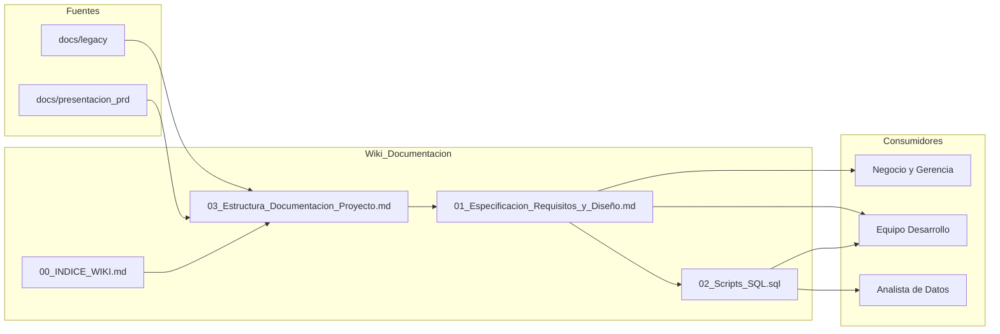
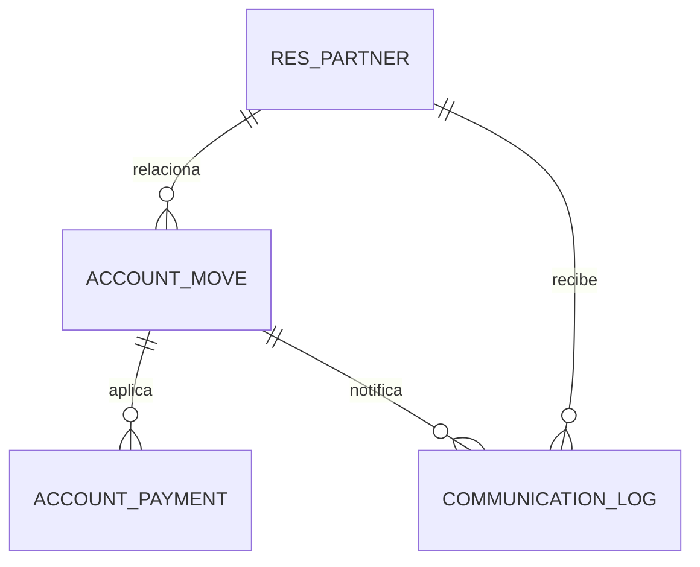
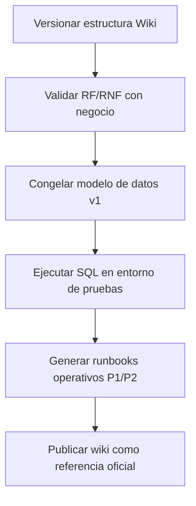

# Estructura de Documentacion del Proyecto
## Finanzas AGV - Estado actual con 2 proyectos principales

**Fecha**: 06 de Marzo de 2026  
**Version**: 1.0  
**Base metodologica**: Extraccion de requisitos y diseno de BD (alineado a `.cursor/extract-requirements-db-design/SKILL.md` y formato de `examples.md`).

---

## 1. Resumen de Portafolio (2 proyectos foco)

### Proyecto P1: Reporteria Financiera Cuenta 12 y 42
- **Objetivo**: Entregar reportes operativos y ejecutivos para CxC (Cuenta 12) y CxP (Cuenta 42) con filtros, exportacion y validacion de datos.
- **Usuarios**: Cobranzas, Tesoreria, Gerencia Financiera.
- **Estado documental**: implementado y en mejora continua.

### Proyecto P2: Automatizacion de Letras y Correos
- **Objetivo**: Automatizar comunicaciones de cobranzas (recordatorios, recupero, trazabilidad, anti-spam 24h).
- **Usuarios**: Cobranzas.
- **Estado documental**: en desarrollo / expansion funcional.

---

## 2. Vista AS-IS / TO-BE por proyecto

### 2.1 Proyecto P1 - Reporteria Cuenta 12 y 42

#### AS-IS
- Consulta acoplada a Odoo via XML-RPC.
- Riesgo de latencia en consultas masivas.
- Exportaciones en demanda y carga variable.
- Dependencia alta del estado de Odoo para la disponibilidad del reporte.

#### TO-BE
- Lectura principal desde almacenamiento analitico (Supabase/PostgreSQL) con sincronizacion incremental.
- Endpoints optimizados para lectura rapida y exportacion asincorna.
- Criterios de validacion y conciliacion automatizables.
- Operacion en modo degradado (read-only) cuando Odoo no este disponible.

### 2.2 Proyecto P2 - Automatizacion de Letras y Correos

#### AS-IS
- Flujo de notificaciones con pasos manuales/parciales.
- Riesgo de reenvios duplicados.
- Trazabilidad de eventos no centralizada.

#### TO-BE
- Motor de reglas para envio por ubicacion y vencimiento.
- Prevencion de duplicados en ventana de 24 horas.
- Log centralizado de comunicaciones (`communication_log`).
- Integracion estable con envio de adjuntos y bitacora auditable.

---

## 3. Arquitectura documental objetivo

---

## 4. Requisitos funcionales consolidados (2 proyectos)

### RF del Proyecto P1 (Reporteria 12/42)

#### RF-P1-001: Generar reporte filtrable de Cuenta 12
- **Descripcion**: El sistema debe mostrar cartera CxC con filtros por fechas, cliente, canal y tipo de documento.
- **Actor**: Analista de Cobranzas.
- **Prioridad**: Must Have
- **Criterios de Aceptacion**:
  - [ ] El reporte devuelve datos consistentes con Odoo.
  - [ ] El usuario puede exportar a Excel.

#### RF-P1-002: Generar reporte filtrable de Cuenta 42
- **Descripcion**: El sistema debe mostrar obligaciones CxP y metadatos operativos (banco, cuenta, orden de compra, estado rendido/no rendido).
- **Actor**: Tesoreria.
- **Prioridad**: Must Have
- **Criterios de Aceptacion**:
  - [ ] Se muestran campos financieros y bancarios requeridos.
  - [ ] La exportacion conserva formato y tipos.

### RF del Proyecto P2 (Letras y Correos)

#### RF-P2-001: Envio masivo de notificaciones de letras vencidas
- **Descripcion**: El sistema debe enviar correos segun estado de letra y criterios de vencimiento.
- **Actor**: Analista de Cobranzas.
- **Prioridad**: Must Have
- **Criterios de Aceptacion**:
  - [ ] Se envia al destinatario validado.
  - [ ] Se adjunta documento soporte cuando corresponda.

#### RF-P2-002: Prevencion de reenvio duplicado
- **Descripcion**: El sistema debe bloquear notificaciones repetidas en 24 horas para el mismo documento y contacto.
- **Actor**: Sistema.
- **Prioridad**: Should Have
- **Criterios de Aceptacion**:
  - [ ] Existe log de control por `move_id`, `partner_id`, `sent_at`.
  - [ ] El bloqueo aplica en cualquier intento dentro de ventana activa.

---

## 5. Requisitos no funcionales consolidados

### Rendimiento
- **RNF-001**: Tiempo de respuesta objetivo para lectura de reportes en interfaz: `< 200ms` en consultas optimizadas.
- **RNF-002**: Exportaciones masivas deben ejecutarse de forma asincorna para no bloquear la experiencia del usuario.

### Disponibilidad
- **RNF-003**: Operacion en modo de disponibilidad alta con consistencia eventual (AP) ante caidas de conexion con Odoo.

### Seguridad y auditoria
- **RNF-004**: Registro de eventos de envio y operaciones de datos con trazabilidad auditable.
- **RNF-005**: Control de acceso por roles para modulos de Cobranzas y Tesoreria.

---

## 6. Modelo de datos consolidado (resumen)

### Entidades clave
- `res_partner` (maestro de terceros)
- `account_move` (facturas/letras)
- `account_payment` (pagos historicos)
- `communication_log` (trazabilidad de envios)

> La especificacion detallada de campos, indices y relaciones se encuentra en `01_Especificacion_Requisitos_y_Diseño.md`.

---

## 7. Trazabilidad (Fuentes -> Requisitos -> Entregables)

| Fuente | Requisito(s) | Entregable Wiki |
|---|---|---|
| `docs/legacy/markdown/rb-103-reportes-cuenta12-42.md` | RF-P1-001, RF-P1-002 | `01_Especificacion_Requisitos_y_Diseño.md` |
| `docs/legacy/markdown/c4model/contexto-proyectos.md` | Alcance P1/P2, flujo macro | `03_Estructura_Documentacion_Proyecto.md` |
| `docs/legacy/markdown/analisis-integracion-datos.md` | RNF-003, estrategia AP | `01_Especificacion_Requisitos_y_Diseño.md` |
| `docs/presentacion_prd/ejemplo3.html` | RF-P2-001, RF-P2-002, arquitectura objetivo | `01_Especificacion_Requisitos_y_Diseño.md` y `03_Estructura_Documentacion_Proyecto.md` |

---

## 8. Roadmap documental recomendado

---

## 9. Definicion de completitud documental
- [ ] Cada RF tiene actor, prioridad y criterios de aceptacion.
- [ ] Cada RNF tiene metrica o condicion verificable.
- [ ] Cada entidad de BD tiene claves e indices definidos.
- [ ] Existe trazabilidad de fuente para cada bloque documental.
- [ ] Diagrama Mermaid por arquitectura y por modelo de datos.

