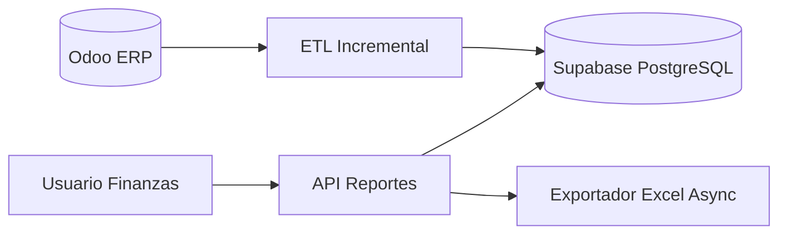
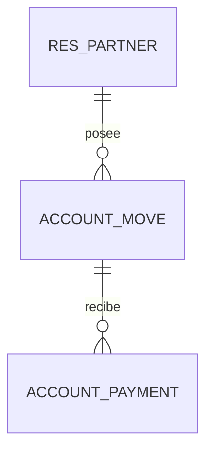
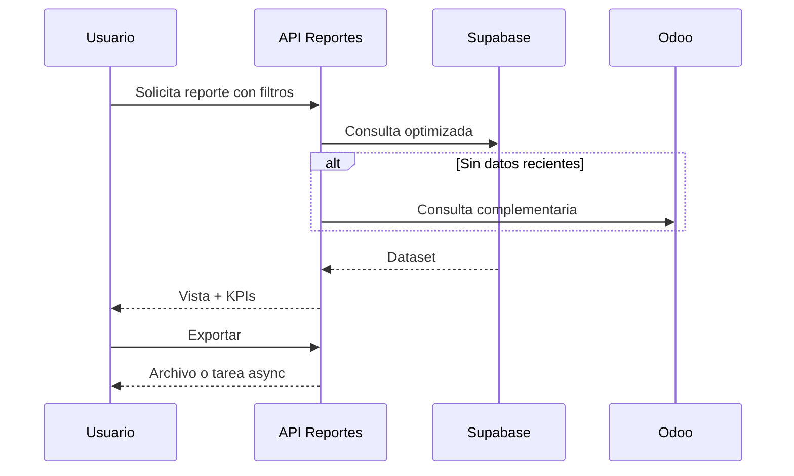

# Especificacion P1 - Reporteria Cuenta 12 y 42

**Proyecto**: P1 Reporteria Financiera  
**Fecha**: 06-03-2026  
**Version**: 1.0

---

## 1. Objetivo
Definir funcional y tecnicamente el proyecto de reporteria de Cuenta 12 (CxC) y Cuenta 42 (CxP), incluyendo estado AS-IS, estado TO-BE, requisitos, reglas de negocio y trazabilidad de datos.

---

## 2. AS-IS / TO-BE

### AS-IS
- Lectura principal desde Odoo via XML-RPC.
- Riesgo de latencia para cargas masivas.
- Dependencia directa de disponibilidad del ERP para consultas.
- Exportaciones y filtros con comportamiento variable segun volumen.

### TO-BE
- Lectura desde base analitica (Supabase/PostgreSQL) con sync incremental.
- Endpoints optimizados por pagina/filtro y exportacion asincorna.
- Mejor trazabilidad del dato contable y control de auditoria.
- Operacion en modo continuidad cuando Odoo no responda.

---

## 3. Requisitos Funcionales

### RF-P1-001: Reporte Cuenta 12 filtrable
- **Descripcion**: mostrar cartera CxC con filtros por fecha, cliente, canal y estado.
- **Actor**: Cobranzas.
- **Prioridad**: Must Have
- **Criterios de Aceptacion**:
  - [ ] Filtros aplican sin recargar flujo completo.
  - [ ] Exportacion a Excel respeta columnas visibles.

### RF-P1-002: Reporte Cuenta 42 filtrable
- **Descripcion**: mostrar CxP con campos bancarios y operativos (orden de compra, rendido/no rendido).
- **Actor**: Tesoreria.
- **Prioridad**: Must Have
- **Criterios de Aceptacion**:
  - [ ] Campos de negocio solicitados visibles y exportables.
  - [ ] Coincidencia con Odoo en muestra de validacion.

### RF-P1-003: Corte historico
- **Descripcion**: calcular saldo a una fecha de corte ignorando pagos posteriores.
- **Actor**: Gerencia Financiera / Tesoreria.
- **Prioridad**: Must Have
- **Criterios de Aceptacion**:
  - [ ] El saldo de corte reconcilia contra fuente oficial.
  - [ ] El algoritmo usa `date_payment <= fecha_corte`.

### RF-P1-004: Exportacion asincorna
- **Descripcion**: ejecutar exportaciones pesadas fuera del request principal.
- **Actor**: Sistema.
- **Prioridad**: Should Have
- **Criterios de Aceptacion**:
  - [ ] El usuario no queda bloqueado en pantalla.
  - [ ] Se registra estado de tarea y resultado.

---

## 4. Requisitos No Funcionales

- **RNF-P1-001 Rendimiento**: tiempo objetivo de lectura en interfaz `< 200ms` para consultas optimizadas.
- **RNF-P1-002 Disponibilidad**: continuidad de consulta en modo read-only ante caida de Odoo.
- **RNF-P1-003 Seguridad**: acceso por rol y sesion valida para endpoints de reportes.
- **RNF-P1-004 Auditoria**: registro de consultas y exportaciones con metadata de usuario.

---

## 5. Reglas de Negocio

### RN-P1-001: Regla de corte historico
Saldo al dia D = `amount_total` - sumatoria de pagos con `date_payment <= D`.

### RN-P1-002: Regla de consistencia de filtro
Todos los filtros aplicados al reporte deben replicarse exactamente en exportacion.

### RN-P1-003: Regla de trazabilidad contable
Toda linea de reporte debe mantener referencia a documento origen (factura/letra/pago) y entidad relacionada.

---

## 6. Modelo de Datos (P1)

Entidades relevantes:
- `res_partner`
- `account_move`
- `account_payment`

Campos criticos para P1:
- `account_move.invoice_date_due`
- `account_move.amount_total`
- `account_move.amount_residual`
- `account_payment.date_payment`
- `account_payment.amount`

---

## 7. Flujo Funcional

---

## 8. Fuentes documentales usadas
- `docs/legacy/markdown/rb-103-reportes-cuenta12-42.md`
- `docs/legacy/markdown/c4model/contexto-proyectos.md`
- `docs/legacy/markdown/informe_ejecutivo.md`
- `docs/legacy/markdown/analisis-arquitectonico-completo.md`
- `docs/presentacion_prd/ejemplo3.html`

