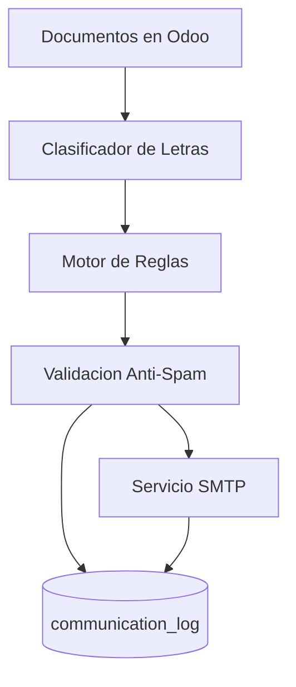
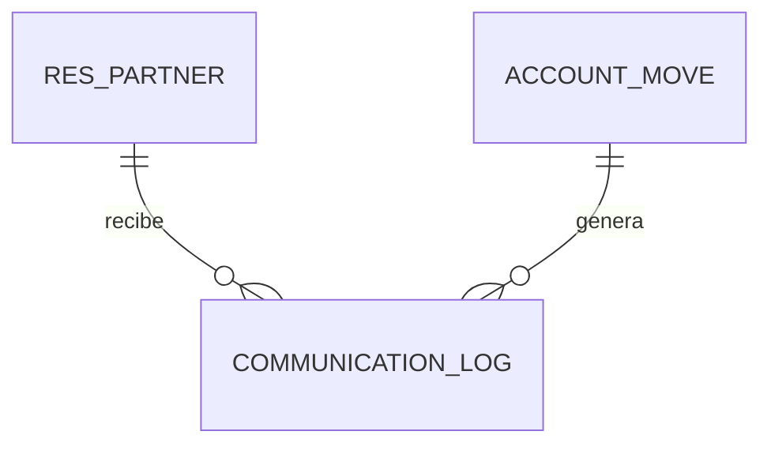
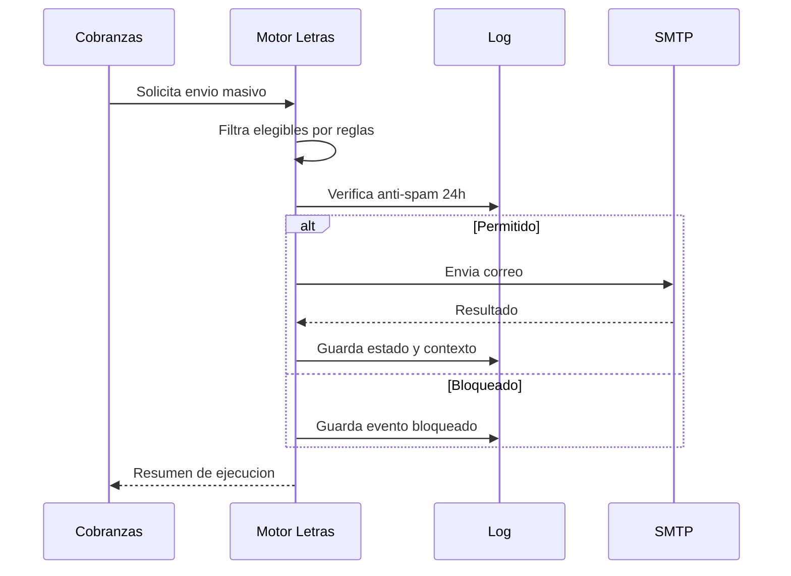

# Especificacion P2 - Letras y Correos

**Proyecto**: P2 Automatizacion de Letras y Correos  
**Fecha**: 06-03-2026  
**Version**: 1.0

---

## 1. Objetivo
Definir el detalle funcional y tecnico del proyecto de automatizacion de letras: identificacion, clasificacion, notificacion, control anti-spam y trazabilidad operativa.

---

## 2. AS-IS / TO-BE

### AS-IS
- Operaciones parciales con fuerte dependencia manual.
- Riesgo de doble envio y baja trazabilidad central.
- Falta de uniformidad para reglas por ubicacion y vencimiento.

### TO-BE
- Motor de reglas automatizadas por ubicacion y fecha.
- Registro de eventos en log estructurado.
- Bloqueo de envios repetidos en ventana de 24 horas.
- Integracion controlada para adjuntos y reportes de estado.

---

## 3. Requisitos Funcionales

### RF-P2-001: Identificacion de letras y origen
- **Descripcion**: identificar letra y factura(s) origen con relacion estructurada.
- **Actor**: Sistema.
- **Prioridad**: Must Have
- **Criterios de Aceptacion**:
  - [ ] El documento de letra referencia trazablemente su origen.
  - [ ] El sistema puede exponer numero de letra y estado.

### RF-P2-002: Clasificacion de estado de letra
- **Descripcion**: clasificar en estados operativos (por aceptar, banco, recuperar, etc.).
- **Actor**: Sistema.
- **Prioridad**: Must Have
- **Criterios de Aceptacion**:
  - [ ] Estado visible en reporte operativo.
  - [ ] Estado actualizable con origen auditable.

### RF-P2-003: Envio masivo de notificaciones
- **Descripcion**: envio masivo de correos a clientes con documentos vencidos.
- **Actor**: Cobranzas.
- **Prioridad**: Must Have
- **Criterios de Aceptacion**:
  - [ ] Soporta lote de destinatarios.
  - [ ] Adjunta documento soporte cuando corresponda.

### RF-P2-004: Prevencion de duplicados (24h)
- **Descripcion**: bloquear reenvio al mismo contacto/documento en 24 horas.
- **Actor**: Sistema.
- **Prioridad**: Must Have
- **Criterios de Aceptacion**:
  - [ ] Valida `move_id + partner_id + ventana 24h`.
  - [ ] Registra razon de bloqueo o envio.

### RF-P2-005: Bitacora de notificaciones
- **Descripcion**: registrar estado de envio (sent, failed, delivered) con fecha y contexto.
- **Actor**: Sistema / Soporte.
- **Prioridad**: Should Have
- **Criterios de Aceptacion**:
  - [ ] Registro disponible para auditoria y soporte.
  - [ ] Reportable por fecha, estado y cliente.

---

## 4. Requisitos No Funcionales

- **RNF-P2-001**: integridad de trazabilidad para cada envio.
- **RNF-P2-002**: idempotencia operativa para evitar duplicados.
- **RNF-P2-003**: observabilidad por logs de proceso y resultado.
- **RNF-P2-004**: seguridad de credenciales SMTP y control de acceso por rol.

---

## 5. Reglas de Negocio

### RN-P2-001: Regla Lima/Provincia
- Lima: ventana de aviso base dia +7.
- Provincia: ventana de aviso base dia +15.

### RN-P2-002: Regla anti-spam
No enviar si existe envio exitoso para mismo `move_id + partner_id` dentro de ultimas 24 horas.

### RN-P2-003: Regla de evidencia de envio
Todo intento de envio debe terminar en estado auditable (`SENT`, `FAILED`, `DELIVERED`) con timestamp y contexto.

---

## 6. Modelo de Datos (P2)

Entidades principales:
- `account_move` (documentos/letras)
- `res_partner` (contactos)
- `communication_log` (trazabilidad de envio)

Campos criticos:
- `communication_log.move_id`
- `communication_log.partner_id`
- `communication_log.status`
- `communication_log.sent_at`
- `communication_log.context`

---

## 7. Flujo funcional P2

---

## 8. Fuentes documentales usadas
- `docs/legacy/guion_reunion_odoo_letras_facturas.md`
- `docs/legacy/markdown/rb-104-envio-masivo-comprobantes.md`
- `docs/legacy/markdown/c4model/contexto-proyectos.md`
- `docs/presentacion_prd/ejemplo3.html`

