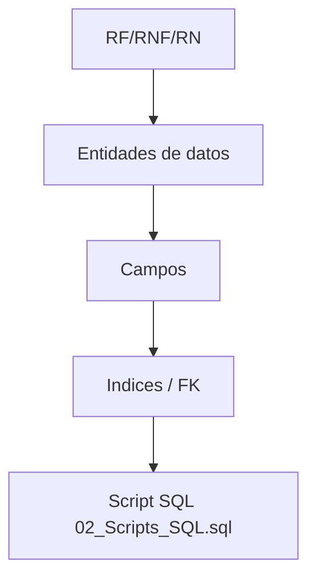
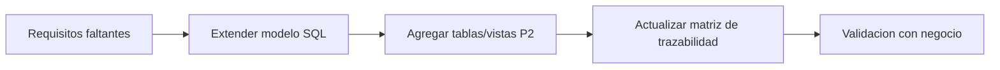

# Matriz RF/RNF/RN vs Tabla-Campo-SQL

**Fecha**: 06-03-2026  
**Version**: 1.0  
**Objetivo**: Proveer trazabilidad completa entre requisitos y artefactos de base de datos.

---

## 1. Mapa de Trazabilidad (alto nivel)

---

## 2. Matriz de Trazabilidad

| ID | Tipo | Descripcion | Tabla(s) | Campo(s) clave | Objeto SQL / Evidencia |
|---|---|---|---|---|---|
| RF-P1-001 | RF | Reporte CxC filtrable | `account_move`, `res_partner` | `invoice_date`, `invoice_date_due`, `partner_id` | `CREATE TABLE account_move`, `idx_move_due_date`, `idx_move_partner` |
| RF-P1-002 | RF | Reporte CxP con campos operativos | `account_move`, `res_partner` | `name`, `state`, `partner_id` | `CREATE TABLE account_move`, FK `fk_move_partner` |
| RF-P1-003 | RF | Corte historico por fecha | `account_payment`, `account_move` | `date_payment`, `amount`, `amount_total` | `CREATE TABLE account_payment`, `idx_payment_date` |
| RF-P1-004 | RF | Exportacion asincorna | N/A (proceso) | N/A | Se soporta por arquitectura; no DDL especifico |
| RF-P2-001 | RF | Identificacion de letra y origen | `account_move` | `id`, `name`, `move_type` | `CREATE TABLE account_move` |
| RF-P2-003 | RF | Envio masivo de notificaciones | `communication_log`, `res_partner` | `partner_id`, `status`, `sent_at` | `CREATE TABLE communication_log`, `idx_log_sent_at` |
| RF-P2-004 | RF | Bloqueo de duplicados 24h | `communication_log` | `move_id`, `partner_id`, `sent_at`, `status` | Funcion `can_send_notification`, `idx_log_move_partner_time` |
| RF-P2-005 | RF | Bitacora de envios | `communication_log` | `status`, `context`, `sent_at` | `CREATE TABLE communication_log` |
| RNF-P1-001 | RNF | Respuesta rapida en lectura | `account_move`, `account_payment` | fechas y FKs | indices `idx_move_due_date`, `idx_payment_date`, `idx_move_partner` |
| RNF-P1-002 | RNF | Continuidad operativa | N/A (arquitectura) | N/A | estrategia AP / sync incremental |
| RNF-P2-002 | RNF | Idempotencia anti-duplicado | `communication_log` | `move_id`, `partner_id`, `sent_at` | funcion `can_send_notification` |
| RN-P1-001 | RN | Formula de corte historico | `account_move`, `account_payment` | `amount_total`, `date_payment`, `amount` | consulta de negocio sobre tablas base |
| RN-P2-001 | RN | Regla Lima/Provincia | `res_partner` | `location_type` | `CHECK location_type IN (...)` |
| RN-P2-002 | RN | Ventana anti-spam 24h | `communication_log` | `sent_at`, `status`, `move_id`, `partner_id` | funcion `can_send_notification` |

---

## 3. Cobertura por tabla

### `res_partner`
- Requisitos cubiertos: RF-P1-001, RF-P1-002, RF-P2-003, RN-P2-001
- Campos clave: `id`, `email`, `location_type`, `write_date`

### `account_move`
- Requisitos cubiertos: RF-P1-001, RF-P1-002, RF-P1-003, RF-P2-001
- Campos clave: `id`, `partner_id`, `invoice_date_due`, `amount_total`, `amount_residual`

### `account_payment`
- Requisitos cubiertos: RF-P1-003, RN-P1-001
- Campos clave: `id`, `move_id`, `date_payment`, `amount`

### `communication_log`
- Requisitos cubiertos: RF-P2-003, RF-P2-004, RF-P2-005, RNF-P2-002
- Campos clave: `move_id`, `partner_id`, `status`, `sent_at`, `context`

---

## 4. Gaps detectados (documentacion vs SQL)

1. **Campos de negocio Cta 42 avanzados** (ej. banco, OC, rendido/no rendido) no estan formalizados en el DDL actual; requieren ampliacion de modelo o vistas materializadas.
2. **Estado detallado de letras** depende de definicion final de Odoo (`move_type`, campos custom, o puente `account.bill.form`).
3. **Exportacion async** y scheduler no requieren DDL directo, pero si documentacion operativa adicional (runbooks de jobs).

---

## 5. Propuesta de ampliacion SQL (siguiente iteracion)

