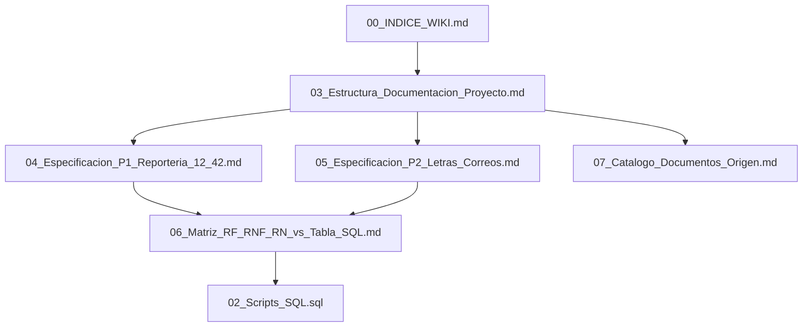

# Catalogo de Documentos Origen (.md)

**Objetivo**: Organizar toda la documentacion Markdown de `docs/` dentro de la estructura de `docs/Wiki_Documentacion` sin perder trazabilidad de origen.

---

## 1. Criterio de organizacion

- **C1 Gobierno y Resumen Ejecutivo**
- **C2 Arquitectura y C4**
- **C3 Runbooks Operativos**
- **C4 Requisitos y Analisis Funcional**
- **C5 Cambios, diagnosticos y soporte**
- **C6 Wiki consolidada (destino)**

---

## 2. Inventario organizado (fuente -> categoria -> destino wiki)

| Fuente Markdown | Categoria | Se integra en |
|---|---|---|
| `docs/legacy/DOCUMENTACION_COMPLETA_GERENCIA.md` | C1 | `03_Estructura_Documentacion_Proyecto.md` |
| `docs/legacy/markdown/informe_ejecutivo.md` | C1 | `03_Estructura_Documentacion_Proyecto.md` |
| `docs/legacy/markdown/c4model/index_c4model.md` | C2 | `03_Estructura_Documentacion_Proyecto.md` |
| `docs/legacy/markdown/c4model/contexto-proyectos.md` | C2 | `03_Estructura_Documentacion_Proyecto.md`, `04`, `05` |
| `docs/legacy/markdown/c4model/letras.md` | C2 | `05_Especificacion_P2_Letras_Correos.md` |
| `docs/legacy/markdown/analisis-arquitectonico-completo.md` | C2 | `01`, `03`, `04` |
| `docs/legacy/markdown/analisis-integracion-datos.md` | C2 | `01`, `03`, `04` |
| `docs/legacy/markdown/ARQUITECTURA_ACTUAL_DOCKER.md` | C2 | `03_Estructura_Documentacion_Proyecto.md` |
| `docs/legacy/markdown/rb-103-reportes-cuenta12-42.md` | C3 | `04_Especificacion_P1_Reporteria_12_42.md` |
| `docs/legacy/markdown/rb-104-envio-masivo-comprobantes.md` | C3 | `05_Especificacion_P2_Letras_Correos.md` |
| `docs/legacy/markdown/rb-101-odoo-connection.md` | C3 | `03_Estructura_Documentacion_Proyecto.md` |
| `docs/legacy/markdown/rb-102-email-failure.md` | C3 | `05_Especificacion_P2_Letras_Correos.md` |
| `docs/legacy/markdown/rb-001-deploy-prod.md` | C3 | `03_Estructura_Documentacion_Proyecto.md` |
| `docs/legacy/markdown/rb-002-db-management.md` | C3 | `01_Especificacion_Requisitos_y_Diseño.md` |
| `docs/legacy/markdown/index_runbooks.md` | C3 | `03_Estructura_Documentacion_Proyecto.md` |
| `docs/legacy/guion_reunion_odoo_letras_facturas.md` | C4 | `05_Especificacion_P2_Letras_Correos.md` |
| `docs/legacy/markdown/informe_tecnico.md` | C4 | `01_Especificacion_Requisitos_y_Diseño.md` |
| `docs/legacy/markdown/0002-plataforma-externa-reporteria.md` | C4 | `04_Especificacion_P1_Reporteria_12_42.md` |
| `docs/legacy/markdown/0003-estrategia-envio-correos.md` | C4 | `05_Especificacion_P2_Letras_Correos.md` |
| `docs/legacy/markdown/manual_usuario.md` | C4 | `03_Estructura_Documentacion_Proyecto.md` |
| `docs/legacy/markdown/manual_desarrollador.md` | C4 | `03_Estructura_Documentacion_Proyecto.md` |
| `docs/legacy/CAMBIOS_LOGIN.md` | C5 | `03_Estructura_Documentacion_Proyecto.md` |
| `docs/legacy/CAMBIOS_VERSION_HIBRIDA.md` | C5 | `04_Especificacion_P1_Reporteria_12_42.md` |
| `docs/legacy/DIAGNOSTICO_KPIS.md` | C5 | `04_Especificacion_P1_Reporteria_12_42.md` |
| `docs/legacy/analisis_discrepancia_cuenta42.md` | C5 | `04_Especificacion_P1_Reporteria_12_42.md` |
| `docs/legacy/resumen_cambios_cuenta42.md` | C5 | `04_Especificacion_P1_Reporteria_12_42.md` |
| `docs/legacy/IMPLEMENTACION_OPTIMIZACION.md` | C5 | `03_Estructura_Documentacion_Proyecto.md` |
| `docs/legacy/MEJORAS_UI_UX.md` | C5 | `03_Estructura_Documentacion_Proyecto.md` |
| `docs/legacy/CHECKLIST_SEGURIDAD.md` | C5 | `03_Estructura_Documentacion_Proyecto.md` |
| `docs/legacy/ESTRUCTURA_PROYECTO.md` | C5 | `00_INDICE_WIKI.md` |
| `docs/legacy/automatizacion-cicd.md` | C5 | `03_Estructura_Documentacion_Proyecto.md` |
| `docs/legacy/CODIGO_NO_USADO.md` | C5 | `03_Estructura_Documentacion_Proyecto.md` |
| `docs/legacy/markdown/modo_desarrollo_correos.md` | C5 | `05_Especificacion_P2_Letras_Correos.md` |
| `docs/legacy/markdown/SOLICITUD_CUENTA_SERVICIO_TI.md` | C5 | `03_Estructura_Documentacion_Proyecto.md` |
| `docs/legacy/markdown/template.md` | C5 | Referencia de formato, no funcional |

---

## 3. Vista de estructura final en Wiki

---

## 4. Resultado esperado para traduccion/documentacion

Con esta organizacion:
- la wiki queda como punto unico de consulta para analisis y traduccion de contenido;
- cada documento original conserva referencia explicita;
- los proyectos P1 y P2 quedan separados, pero conectados por matriz de trazabilidad;
- los artefactos SQL estan vinculados directamente a requisitos de negocio.

