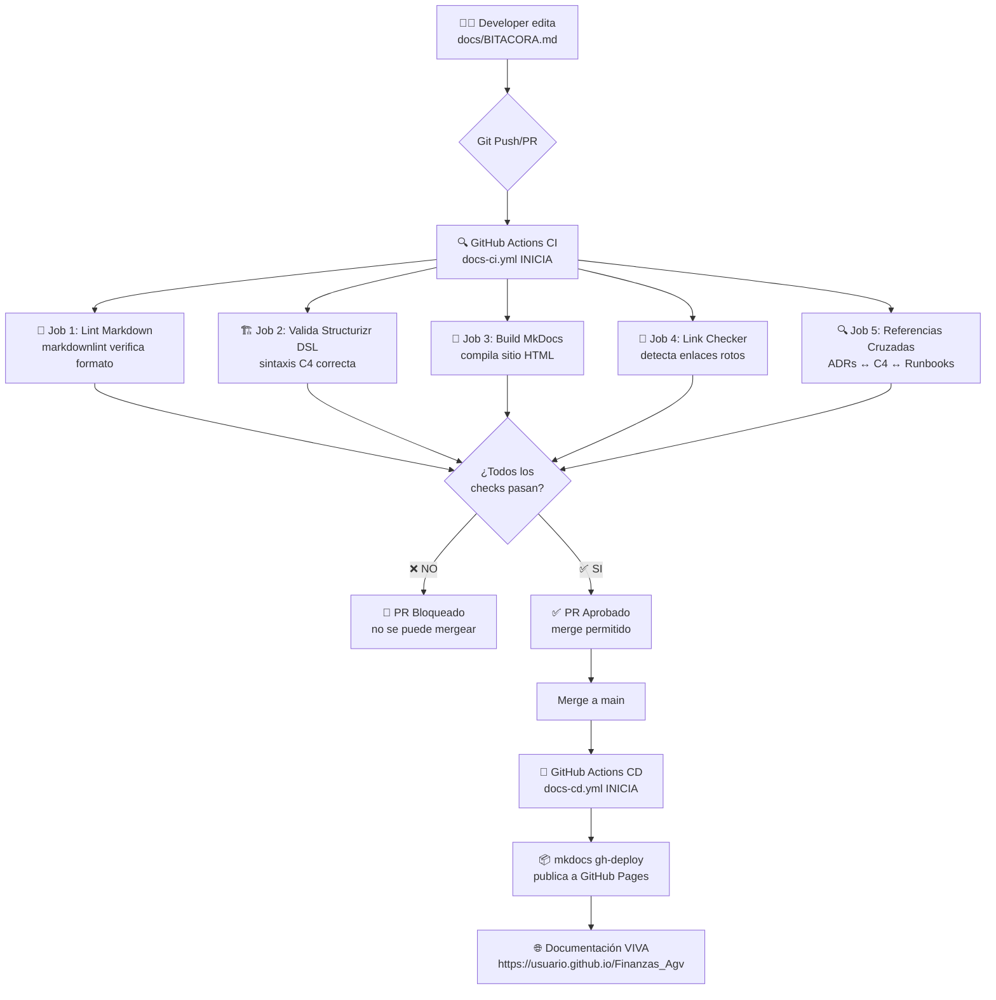

# 🤖 Flujo de Automatización CI/CD

Esta página explica cómo funciona la automatización de la documentación viva en este proyecto.

!!! success "Documentación que se valida a sí misma"
    Cada cambio pasa por validaciones automáticas antes de ser publicado, garantizando calidad y consistencia.

---

## 📊 Diagrama del Flujo Completo



---

## 🔄 Fase 1: Edición y Commit

### Paso a Paso

1. **Developer hace cambios locales:**
```bash
# Edita cualquier archivo de documentación
nano docs/BITACORA.md

# O crea nuevos ADRs
cp docs/adrs/template.md docs/adrs/0002-nueva-decision.md
```

2. **Commit y Push:**
```bash
git add docs/
git commit -m "docs: actualiza bitácora con nueva funcionalidad"
git push origin feature/nueva-feature
```

3. **Abre Pull Request en GitHub**

---

## 🔍 Fase 2: Validación Automática (CI)

**Archivo:** `.github/workflows/docs-ci.yml`

**Se dispara cuando:**
- Abres un Pull Request hacia `main` o `develop`
- Haces push a `main`
- Modificas archivos en `docs/**` o `mkdocs.yml`

### Jobs que se Ejecutan

#### 1️⃣ Lint Markdown (`lint-markdown`)

**Propósito:** Verificar formato consistente de archivos `.md`

**Herramienta:** `markdownlint-cli`

**Qué valida:**
- ✅ Títulos correctamente formateados
- ✅ Listas con espaciado apropiado
- ✅ Líneas no excesivamente largas
- ✅ Sin HTML innecesario

**Configuración:** `.markdownlint.json`

```json
{
  "default": true,
  "MD013": false,  // Permite líneas largas
  "MD033": false,  // Permite HTML embebido
  "MD041": false   // No requiere H1 al inicio
}
```

---

#### 2️⃣ Validar Structurizr DSL (`validate-structurizr`)

**Propósito:** Asegurar que el modelo C4 tenga sintaxis correcta

**Herramienta:** Structurizr CLI oficial

**Proceso:**
1. Descarga última versión de Structurizr CLI
2. Ejecuta validación sobre `docs/c4model/workspace.dsl`
3. Si hay error de sintaxis → Pipeline FALLA

**Ejemplo de error detectado:**
```
ERROR: Line 25: Missing closing brace in model definition
```

---

#### 3️⃣ Construir Documentación (`build-docs`)

**Propósito:** Compilar el sitio MkDocs y detectar problemas

**Modo:** `mkdocs build --strict`

**Qué detecta:**
- ❌ Enlaces a páginas inexistentes
- ❌ Referencias a imágenes faltantes
- ❌ Errores en configuración `mkdocs.yml`
- ❌ Páginas huérfanas (no en navegación)

**Salida:** Genera carpeta `site/` con HTML compilado y la sube como artefacto.

---

#### 4️⃣ Verificar Enlaces (`check-links`)

**Propósito:** Detectar enlaces rotos antes de publicar

**Herramienta:** `linkchecker` (Python)

**Qué valida:**
- ✅ Enlaces internos entre documentos
- ✅ Enlaces externos (APIs, documentación externa)
- ✅ Imágenes y recursos

**Ejemplo de error detectado:**
```
Error: URL 'docs/adrs/0003-backup.md' results in HTTP 404
```

---

#### 5️⃣ Validar Referencias Cruzadas (`validate-cross-references`)

**Propósito:** Garantizar trazabilidad entre artefactos

**Validaciones:**
- ✅ ADRs mencionan componentes C4 afectados
- ✅ Runbooks citan ADRs que justifican procedimientos
- ✅ Arquitectura referencia decisiones tomadas

**Script:**
```bash
# Busca que ADRs mencionen arquitectura
grep -r "C4\|componente\|arquitectura" docs/adrs/*.md

# Busca que Runbooks referencien ADRs
grep -r "ADR-\|decisión" docs/runbooks/*.md
```

---

## ✅ Resultado de CI

### Si TODO pasa:
```
✅ lint-markdown       PASSED
✅ validate-structurizr PASSED
✅ build-docs          PASSED
✅ check-links         PASSED
✅ validate-cross-references PASSED

🟢 All checks have passed
```
→ **Pull Request puede ser mergeado**

### Si algo falla:
```
✅ lint-markdown       PASSED
❌ build-docs          FAILED
   Error: Page 'docs/runbooks/rb-003.md' not found
```
→ **Pull Request BLOQUEADO hasta corregir**

---

## 🚀 Fase 3: Despliegue Automático (CD)

**Archivo:** `.github/workflows/docs-cd.yml`

**Se dispara cuando:**
- Haces merge/push a `main`
- Modificaste `docs/**` o `mkdocs.yml`

### Proceso de Despliegue

1. **Checkout del código actualizado**
```yaml
- uses: actions/checkout@v4
  with:
    fetch-depth: 0  # Historial completo para git
```

2. **Configurar entorno Python**
```yaml
- uses: actions/setup-python@v5
  with:
    python-version: '3.11'
    cache: 'pip'  # Cachea dependencias para velocidad
```

3. **Instalar MkDocs**
```bash
pip install mkdocs mkdocs-material
```

4. **Configurar credenciales Git**
```bash
git config user.name "github-actions[bot]"
git config user.email "github-actions[bot]@users.noreply.github.com"
```

5. **Desplegar a GitHub Pages**
```bash
mkdocs gh-deploy --force --clean --verbose
```

Este comando:
- Compila el sitio en `site/`
- Crea/actualiza rama `gh-pages`
- Sube el HTML compilado
- GitHub Pages automáticamente sirve esa rama

---

## 🌐 Acceso a la Documentación Publicada

Una vez desplegado, tu documentación estará en:

```
https://<tu-usuario>.github.io/<nombre-repo>/
```

Para este proyecto:
```
https://josemontero-agv.github.io/Finanzas_Agv/
```

---

## 🔐 Permisos y Seguridad

El workflow CD tiene permisos específicos:

```yaml
permissions:
  contents: write   # Modificar repo (crear rama gh-pages)
  pages: write      # Desplegar a GitHub Pages
  id-token: write   # Autenticación segura
```

**Beneficio:** Solo el bot de GitHub Actions puede desplegar. Ningún humano puede saltarse las validaciones.

---

## 🛠️ Comandos Útiles Locales

### Ver documentación antes de commit:
```bash
mkdocs serve
# Abre http://127.0.0.1:8000
```

### Validar construcción sin desplegar:
```bash
mkdocs build --strict
```

### Validar Markdown manualmente:
```bash
markdownlint 'docs/**/*.md' --config .markdownlint.json
```

### Validar enlaces manualmente:
```bash
mkdocs build
linkchecker site/
```

---

## 📚 Referencias

- **Workflows CI/CD:** 
  - Ver archivo `.github/workflows/docs-ci.yml` en el repositorio
  - Ver archivo `.github/workflows/docs-cd.yml` en el repositorio
- **Guía de GitHub Actions:** [Ver guía de activación](github-pages-setup.md)
- **MkDocs Deployment:** [Documentación oficial](https://www.mkdocs.org/user-guide/deploying-your-docs/)

