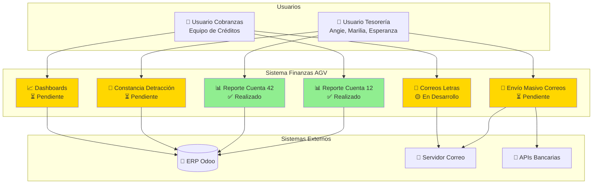
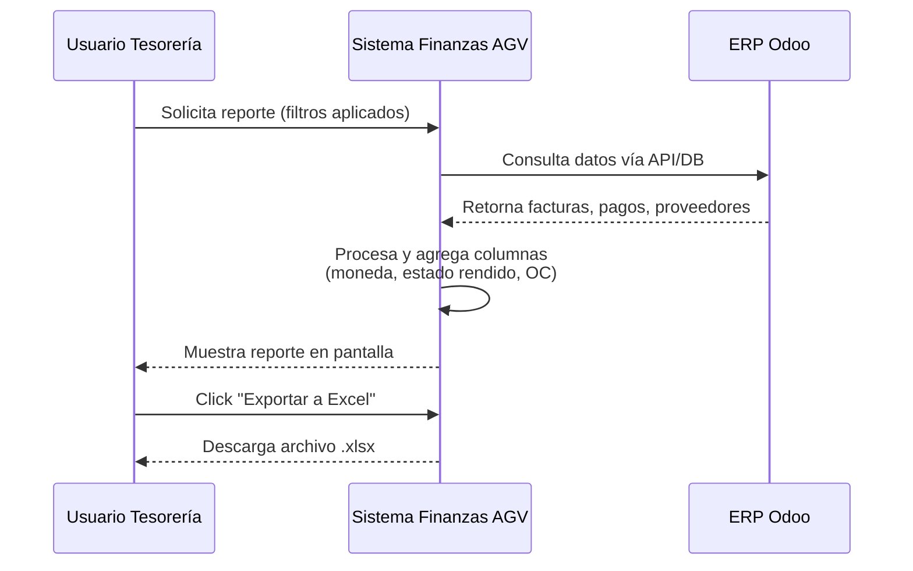
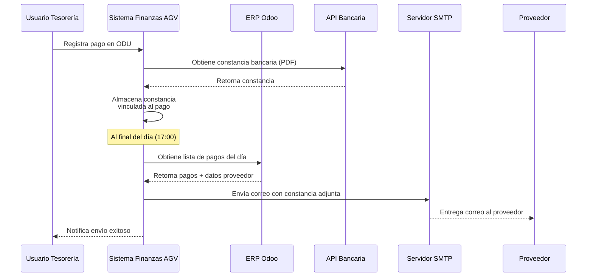

# 🗺️ Mapa de Proyectos en el Contexto del Sistema

!!! info "Vista Complementaria al C4"
    Este documento muestra cómo los proyectos actuales se relacionan con los componentes del sistema descritos en el [Modelo C4](index_c4model.md).

---

## 🔗 Relación entre Proyectos y Arquitectura

### Contexto del Sistema (C1)

El siguiente diagrama muestra cómo los proyectos en desarrollo se conectan con los diferentes componentes del sistema:

---

## 📊 Tabla de Mapeo: Proyectos vs. Componentes Arquitectónicos

| Proyecto | Usuario Solicitante | Sistema Externo Relacionado | ADR/Runbook Relacionado | Estado |
| :--- | :--- | :--- | :--- | :---: |
| **Reporte Cuenta 12** | Equipo Cobranzas | ERP Odoo | [ADR-002](../adrs/0002-plataforma-externa-reporteria.md), [RB-103](../runbooks/rb-103-reportes-cuenta12-42.md) | ✅ |
| **Reporte Cuenta 42** | Marilia Tinoco, Angie Gomero | ERP Odoo | [ADR-002](../adrs/0002-plataforma-externa-reporteria.md), [RB-103](../runbooks/rb-103-reportes-cuenta12-42.md) | ✅ |
| **Envío Masivo de Comprobantes** | Angie Gomero, Marilia Tinoco | Servidor SMTP, APIs Bancarias | [ADR-003](../adrs/0003-estrategia-envio-correos.md), [RB-104](../runbooks/rb-104-envio-masivo-comprobantes.md) | ⏳ |
| **Correos de Letras (Banco y Recuperar)** | Equipo Cobranzas | Servidor SMTP, ERP Odoo | [RB-102](../runbooks/rb-102-email-failure.md) | 🟡 |
| **Constancia de Detracción** | Tesorería | ERP Odoo, SUNAT | (Pendiente ADR) | ⏳ |
| **Dashboard Nacional** | Equipo Cobranzas | ERP Odoo | (Pendiente ADR) | ⏳ |
| **Dashboard Internacional** | Equipo Cobranzas | ERP Odoo | (Pendiente ADR) | ⏳ |

---

## 🔄 Flujo de Datos por Proyecto

### 1. Reportes Cuenta 12 y 42

**Decisión Arquitectónica:** [ADR-002: Plataforma Externa para Reportería](../adrs/0002-plataforma-externa-reporteria.md)

---

### 2. Envío Masivo de Comprobantes

**Decisión Arquitectónica:** [ADR-003: Estrategia de Envío Masivo de Correos](../adrs/0003-estrategia-envio-correos.md) (Propuesta)

---

## 🏗️ Impacto en la Arquitectura

### Componentes Afectados por los Proyectos

| Componente del Sistema | Proyectos que lo Usan | Tipo de Cambio |
| :--- | :--- | :--- |
| **Conexión Odoo (app/core/odoo.py)** | Todos los reportes, Detracciones | Modificación de queries, nuevos campos |
| **Servicio de Emails (app/emails/)** | Envío Masivo, Correos de Letras | Nueva funcionalidad de adjuntos masivos |
| **Servicio de Cobranzas (app/collections/)** | Reporte Cta 12, Correos Letras | Nuevas funciones de procesamiento |
| **Servicio de Tesorería (app/treasury/)** | Reporte Cta 42, Constancia Detracción | Nuevas funciones de procesamiento |
| **Templates HTML** | Todos los reportes | Nuevas columnas, filtros mejorados |

### Nuevos Componentes a Crear

| Componente | Justificación | Prioridad |
| :--- | :--- | :---: |
| **Servicio de Adjuntos (app/attachments/)** | Gestión centralizada de constancias bancarias | Alta |
| **Integración Bancaria (app/banks/)** | Obtención automática de comprobantes | Media |
| **Scheduler de Tareas (app/scheduler/)** | Envíos programados (cron jobs) | Alta |
| **Dashboard Service (app/dashboards/)** | Agregaciones y KPIs en tiempo real | Media |

---

## 🎯 Próximos Pasos Arquitectónicos

### Corto Plazo (1-2 meses)

1. ✅ **Completar Reportes Cta 12 y 42** - Revisión final de gerencia
2. 🟡 **Implementar Correos de Letras** - Finalizar módulo en desarrollo
3. ⏳ **Diseñar Sistema de Adjuntos** - ADR-003 debe pasar a "Aceptado"

### Mediano Plazo (3-6 meses)

4. Implementar Dashboards (Nacional e Internacional)
5. Integración con APIs bancarias (Interbank, BBVA)
6. Migración a PostgreSQL Read Replica (ver [Análisis Arquitectónico](../mejoras-stack-arquitectura/analisis-arquitectonico-completo.md))

### Largo Plazo (6-12 meses)

7. Portal de Proveedores (autoservicio)
8. Celery + Redis para tareas asíncronas
9. Evaluación de microservicios (si el monolito crece significativamente)

---

## 📚 Referencias

- [Vista C4 Principal](index_c4model.md) - Diagrama de Contexto del Sistema
- [Reporte de Estado de Proyectos](../reporte-estado-proyectos.md) - Estado actual de todos los proyectos
- [Análisis Arquitectónico Completo](../mejoras-stack-arquitectura/analisis-arquitectonico-completo.md) - Recomendaciones técnicas
- [Índice de ADRs](../adrs/index_adrs.md) - Decisiones arquitectónicas documentadas
- [Índice de Runbooks](../runbooks/index_runbooks.md) - Procedimientos operacionales

---

**Última Actualización:** 25 de Noviembre de 2025  
**Responsable:** José Montero

