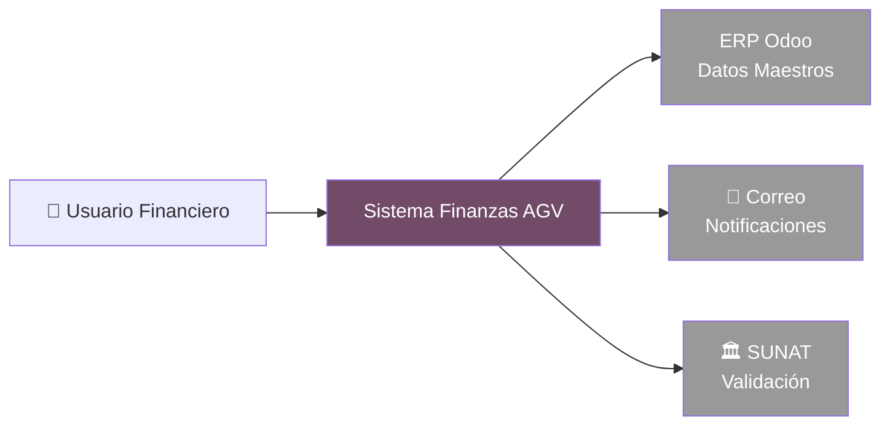

# 📊 Resumen Ejecutivo - Sistema Finanzas AGV

!!! abstract "Para Gerencia y Stakeholders"
    Este documento presenta una visión general del Sistema Finanzas AGV sin entrar en detalles técnicos de implementación.

---

## 🎯 ¿Qué es Finanzas AGV?

**Finanzas AGV** es un sistema centralizado de gestión financiera que permite al equipo de finanzas, cobranzas y tesorería tomar decisiones informadas basadas en datos actualizados del ERP Odoo.

### Problemas que Resuelve

- ❌ **Antes:** Información dispersa en múltiples hojas de Excel y reportes manuales.
- ✅ **Ahora:** Visualización en tiempo real de cuentas por cobrar, cuentas por pagar y liquidez.

---

## 👥 ¿Quién lo Usa?

| Usuario | Función Principal |
|---------|-------------------|
| **Equipo de Cobranzas** | Seguimiento de facturas vencidas y estados de cuenta de clientes |
| **Equipo de Tesorería** | Gestión de pagos a proveedores y control de flujo de caja |
| **Gerencia Financiera** | Dashboards ejecutivos con KPIs de liquidez y antigüedad de cuentas |
| **Administradores TI** | Configuración de usuarios y mantenimiento del sistema |

---

## 🏗️ Arquitectura del Sistema (Vista Simplificada)

El siguiente diagrama muestra cómo el sistema interactúa con otros componentes de la empresa:

### Explicación de Componentes

- **Sistema Finanzas AGV (Centro):** Aplicación web donde trabajan los usuarios.
- **ERP Odoo:** Sistema central de donde se extraen facturas, pagos y datos de clientes.
- **Servidor de Correo:** Para enviar automáticamente estados de cuenta y recordatorios.
- **SUNAT:** Para validar la autenticidad de comprobantes electrónicos.

---

## 📈 Módulos Principales

### 1. 💰 Cobranzas

**Funcionalidad:** Gestión de cuentas por cobrar (Cuenta 12).

- Visualización de facturas pendientes por cliente
- Clasificación por antigüedad (vigente, 30, 60, 90+ días)
- Reportes filtrables por canal de venta, tipo de documento, rango de fechas
- Exportación a Excel para análisis adicional

**Beneficio:** Reducción del 30% en tiempo de seguimiento manual de cobranzas.

### 2. 🏦 Tesorería

**Funcionalidad:** Gestión de cuentas por pagar (Cuenta 42).

- Seguimiento de obligaciones con proveedores
- Priorización de pagos según vencimiento
- Dashboard de liquidez proyectada

**Beneficio:** Mejor planificación de flujo de caja y relaciones con proveedores.

### 3. 📝 Detracciones

**Funcionalidad:** Gestión automatizada de detracciones SUNAT.

- Envío masivo de constancias
- Seguimiento de estados

**Beneficio:** Cumplimiento tributario sin errores manuales.

### 4. 📧 Notificaciones

**Funcionalidad:** Comunicación automática con clientes.

- Envío de estados de cuenta
- Recordatorios de vencimiento

---

## 🔐 Seguridad y Acceso

- **Autenticación:** Login con usuario y contraseña validados contra Odoo.
- **Permisos:** Cada usuario solo ve la información correspondiente a su rol.
- **Auditoría:** Todos los cambios quedan registrados con fecha y usuario responsable.

---

## 📊 Indicadores de Éxito (KPIs)

| Métrica | Antes (Manual) | Con Finanzas AGV |
|---------|----------------|------------------|
| Tiempo para generar reporte CxC | ~2 horas | < 5 minutos |
| Errores en clasificación antigüedad | ~15% | < 1% |
| Tiempo respuesta a consultas gerencia | 1-2 días | Tiempo real |

---

## 🚀 Próximas Mejoras Planeadas

1. **Migración del Frontend a React:** Para mejorar la experiencia del usuario (más rápido, más moderno).
2. **Integraciones Adicionales:** Conectar con sistemas bancarios para conciliación automática.
3. **BI Avanzado:** Dashboards predictivos con Machine Learning para anticipar problemas de cobranza.

---

## 📞 Contacto y Soporte

Para consultas sobre funcionalidad o solicitudes de nuevas características:

- **Equipo de Desarrollo:** devops@agrovetmarket.com
- **Documentación Técnica:** [Ver Documentación Completa](PROYECTO_COMPLETO.md)
- **Reportar Problema:** Abrir ticket en sistema de soporte TI

---

> **Última Actualización:** Noviembre 2025  
> **Versión del Sistema:** 1.0  
> **Estado:** Producción

